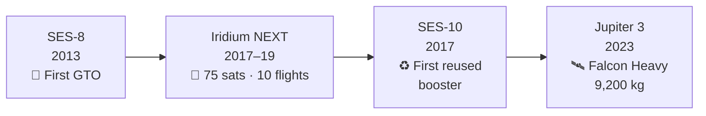

# Notable Commercial Launches

> **SpaceX transformed the commercial launch market by offering reliable, cost-effective access to orbit — winning customers from incumbents and proving reusable hardware on paying missions.**

## 🎯 Intuition
**The Core Idea:** SpaceX won commercial launch customers by pairing lower prices with proven mission performance, then used paying missions to normalize booster reuse.
**Analogy:** Like a budget airline that proved it could fly first-class routes — winning premium customers with lower fares.
**Why It Matters:** Commercial launches are the economic engine that funds SpaceX's reusability R&D and Starship development. Each successful commercial flight reinforces the reliability record that shapes insurance rates, customer confidence, and regulatory trust. The move from expendable to reusable operations on revenue missions proved that reuse was a real business model, not just a technical stunt.

---

## ⚙️ Core Mechanics

SpaceX's commercial launch business began in earnest with **SES-8** in December 2013, the company's first mission to **GTO**. That flight proved Falcon 9 could compete in the high-energy commercial market, and its much lower pricing let SpaceX capture a majority share of global commercial launch business within a few years.

The company then proved it could execute both cadence and reuse on paying missions. **Iridium NEXT** used 10 Falcon 9 launches to deploy 75 satellites between 2017 and 2019, **SES-10** became the first commercial mission on a flight-proven booster in March 2017, and later missions such as **Turksat 5B**, **HOTBIRD 13G**, and **Hughes Jupiter 3** showed direct-to-GEO and heavy-payload commercial capability.

### Key Details / Specifications

| Mission / Campaign | Date | Commercial Significance | Result |
|---|---|---|---|
| SES-8 | December 2013 | First SpaceX commercial GTO mission | Proved Falcon 9 could compete in high-energy telecom launches |
| Iridium NEXT | 2017-2019 | Large multi-launch constellation contract | 10 launches deployed 75 satellites |
| SES-10 | March 2017 | First commercial flight on a reused booster | Opened the reuse era for paying customers |
| Turksat 5B / HOTBIRD 13G | 2021-2022 | Direct-to-GEO commercial delivery | Showed higher-energy mission capability |
| Hughes Jupiter 3 | July 2023 | Very heavy GEO communications payload | Demonstrated Falcon Heavy commercial utility |

### Key Facts
- **SES-8** (December 2013): first SpaceX GTO commercial mission, validating Falcon 9 v1.1 upper-stage restart capability
- **Iridium NEXT**: 10 launches, 75 satellites, 2017–2019 — largest single-customer campaign at the time
- **SES-10** (March 2017): first commercial mission on a flight-proven booster, opening the reuse era
- SpaceX captured over 60% of global commercial launch contracts by revenue in multiple years after 2017
- **Turksat 5B** and **HOTBIRD 13G** demonstrated direct-to-GEO capability, eliminating months of electric-propulsion orbit raising for customers
- **Hughes Jupiter 3** on Falcon Heavy (July 2023) was among the heaviest commercial GEO payloads ever launched
- Rideshare add-ons on commercial missions pioneered the secondary-payload business model before dedicated Transporter flights

---

## 🔬 Deep Dive
### Engineering Details
SpaceX's commercial launch business began in earnest with the **SES-8** mission in December 2013, the company's first delivery to geostationary transfer orbit (GTO). That flight demonstrated Falcon 9 could compete for the high-energy missions that had long been the exclusive domain of Arianespace, ILS, and ULA. Within a few years, SpaceX captured the majority of the global commercial launch market by offering prices roughly half those of competitors — around $62 million for a standard Falcon 9 flight versus $150–200 million for an Ariane 5 or Atlas V equivalent.

The **Iridium NEXT** constellation program became a landmark partnership: 10 dedicated Falcon 9 launches between 2017 and 2019 deploying all 75 replacement satellites for the Iridium mobile communications network. This campaign proved SpaceX could execute a high-cadence, multi-launch contract on schedule — a capability that had eluded many legacy providers. Iridium CEO Matt Desch became one of SpaceX's most vocal advocates.

Later missions extended SpaceX's reach into higher-energy direct-to-GEO profiles. **Turksat 5B** (2021) and **Eutelsat HOTBIRD 13G** (2022) were delivered to near-geosynchronous orbits, requiring full expenditure of the first stage. **Hughes Jupiter 3** (2023), one of the heaviest commercial communications satellites ever launched at roughly 9,200 kg, showcased Falcon Heavy's commercial utility. A critical milestone in customer trust came when operators began accepting flights on previously-flown boosters — SES was the first GTO customer to fly on a reflown core (SES-10 in March 2017), breaking the psychological barrier around reuse.

### Challenges and Risks
- Entering the commercial GTO market required Falcon 9 to compete against entrenched providers on both performance and insurer confidence.
- High-energy direct-to-GEO missions can force first-stage expenditure, limiting the reuse advantage on some premium payloads.
- Multi-launch constellation campaigns demand schedule discipline across many flights, not just one successful launch.
- Early commercial customers had to overcome a psychological trust barrier before accepting flight-proven boosters.

### Comparison / Context

| Distinction | Explanation |
|---|---|
| GTO vs direct-to-GEO | GTO requires the satellite to raise its own orbit; direct-to-GEO places it at final altitude, using more booster performance |
| Expendable vs reusable | Some heavy GEO missions require expending the first stage to meet energy requirements |
| Dedicated vs rideshare | Dedicated missions serve one primary customer; rideshare adds secondary payloads |
| Flight-proven vs new booster | Flight-proven cores have flown before; early customers demanded new boosters at a premium |
| Falcon 9 vs Falcon Heavy | Heavy GEO payloads exceeding Falcon 9's reusable capacity require Falcon Heavy |

---

## 🏋️ Practice
### Discussion Questions
1. Why was SES-8 such an important step in SpaceX's commercial market breakthrough?
2. How did Iridium NEXT and SES-10 prove different aspects of SpaceX's commercial value proposition?
3. What future kinds of commercial missions are most likely to favor Falcon Heavy or Starship over Falcon 9?

### Analysis Scenarios
1. If early telecom operators had refused reflown boosters, how might that have slowed SpaceX's commercial strategy?
2. Suppose a customer can choose between a cheaper GTO mission and a pricier direct-to-GEO insertion; when would the higher launch price make sense?

### Challenge
- Choose one mission from this page and explain how it helped SpaceX shift the commercial launch market away from legacy providers.

---

*See also:* [[Missions and Payloads Overview]]
