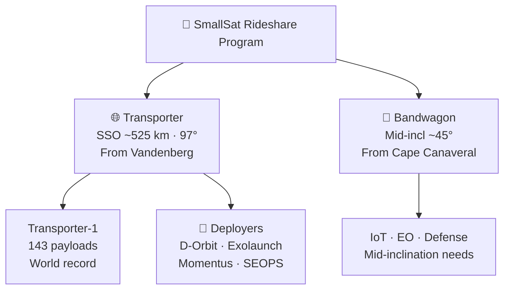

# Rideshare and Transporter Missions

> **SpaceX's SmallSat Rideshare Program and dedicated Transporter missions democratized orbital access, enabling startups and institutions to launch payloads for as little as $275,000 per slot.**

## 🎯 Intuition
**The Core Idea:** SpaceX used Falcon 9's excess capacity to turn orbital launch into a shared service for small satellites.
**Analogy:** Like a bus route to orbit — dozens of small passengers sharing one big ride at a fraction of the cost.
**Why It Matters:** The Transporter and Bandwagon programs collapsed the cost and schedule barriers that previously limited smallsat access to orbit. Before them, operators often waited years for a secondary slot or paid millions for a dedicated small launcher. SpaceX's rideshare model helped fuel the modern NewSpace economy by enabling more Earth-observation, IoT, and technology-demonstration missions.

---

## ⚙️ Core Mechanics

SpaceX announced its **SmallSat Rideshare Program** in August 2019, offering rideshare launches to **SSO** at $1 million per 200 kg and individual slots from **$275,000 for 50 kg**. The first dedicated mission, **Transporter-1** in January 2021, carried **143 payloads** and set a world record for satellites deployed on a single launch.

Transporter missions established a regular rideshare cadence supported by deployer companies such as **D-Orbit**, **Momentus**, **Exolaunch**, and **SEOPS**, while **Bandwagon** missions added **~45° mid-inclination** options from Cape Canaveral for customers whose Earth observation, IoT, or defense needs were not well served by sun-synchronous orbit.

### Key Details / Specifications

| Product / Mission | Orbit / Profile | Commercial Role | Notable Result |
|---|---|---|---|
| SmallSat Rideshare Program | Shared Falcon 9 capacity | Low-cost access to orbit | Prices starting at $275,000 for 50 kg |
| Transporter | ~525 km sun-synchronous orbit from Vandenberg | Standard bulk rideshare offering | 10+ flights by early 2025 |
| Transporter-1 | January 2021 SSO mission | First dedicated rideshare mission | 143 payloads, world record at the time |
| Bandwagon | ~45° inclination from Cape Canaveral | Mid-inclination rideshare option | Expanded service beyond SSO customers |
| Deployer partners | Carrier and integration layer | Aggregate payloads and provide last-mile services | D-Orbit, Momentus, Exolaunch, SEOPS |

### Key Facts
- **Transporter-1** (January 2021): 143 payloads deployed, setting a single-launch world record
- Starting price of **$275,000** for a 50 kg slot; $1 million for 200 kg (prices periodically revised)
- Transporter missions launch to approximately **525 km SSO** from Vandenberg Space Force Base
- **Bandwagon** missions target **~45° inclination**, launching from Cape Canaveral
- Key deployer partners: D-Orbit (ION), Momentus (Vigoride), Exolaunch (EXOpod), SEOPS (Slingshot)
- By early 2025, SpaceX had flown **10+ Transporter** and multiple Bandwagon missions
- Transporter missions typically fly on **flight-proven boosters**, returning to land at the launch site
- The program effectively disrupted dedicated small-launch vehicles (Rocket Lab, Virgin Orbit, Astra) on price

---

## 🔬 Deep Dive
### Engineering Details
SpaceX announced its **SmallSat Rideshare Program** in August 2019, offering dedicated rideshare launches to sun-synchronous orbit (SSO) at a starting price of $1 million per 200 kg, with individual slots available from **$275,000 for 50 kg**. This pricing undercut existing smallsat launch brokers and dedicated small-launch vehicles by a wide margin, leveraging Falcon 9's massive excess capacity to SSO. The first dedicated rideshare mission, **Transporter-1**, launched in January 2021 carrying 143 payloads — a world record for the most satellites deployed on a single launch at that time.

Subsequent Transporter missions have maintained a roughly quarterly cadence, each carrying between 50 and 115+ payloads from a diverse mix of commercial operators, government agencies, universities, and technology demonstrators. Third-party **deployer companies** play a critical role in the ecosystem: firms like **D-Orbit** (ION satellite carrier), **Momentus** (Vigoride tug), and **Exolaunch** (EXOpod and releasable adapters) aggregate multiple smallsats, handle integration, and sometimes provide last-mile orbit adjustment. This layered approach allows even cubesat operators with minimal launch experience to reach orbit.

In 2023, SpaceX introduced **Bandwagon** missions — a new rideshare product targeting **mid-inclination orbits** (approximately 45°) rather than the SSO inclination used by Transporter flights. Bandwagon missions address the needs of customers requiring lower-inclination orbits for Earth observation, IoT, or defense applications that SSO does not optimally serve. Together, Transporter and Bandwagon give SpaceX a rideshare portfolio covering the two most popular orbital regimes for small satellites. Slot prices have been periodically adjusted upward to reflect demand, but remain far below alternatives.

### Challenges and Risks
- Rideshare customers trade low cost for less control over mission timing and exact orbital tailoring.
- High payload counts increase integration complexity and make deployer partners critical to successful execution.
- Different orbital needs forced SpaceX to add Bandwagon rather than rely on a single SSO product.
- Low pricing disrupted dedicated small-launch competitors, but that same price pressure makes the market strategically intense.

### Comparison / Context

| Distinction | Explanation |
|---|---|
| Transporter vs Bandwagon | Transporter serves SSO (~97°); Bandwagon serves mid-inclination (~45°) |
| Rideshare vs dedicated launch | Rideshare shares the rocket among many payloads; dedicated missions serve one customer |
| Deployer vs direct integration | Deployers (D-Orbit, Exolaunch) aggregate smallsats on a carrier; direct integration mounts to the ESPA ring |
| ESPA vs freeflyer port | ESPA Grande/Small ports accommodate different payload sizes on the adapter ring |
| Price per kg vs price per slot | SpaceX prices by slot weight; small-launcher competitors often price per mission |

---

## 🏋️ Practice
### Discussion Questions
1. Why did Falcon 9's large capacity make the rideshare model so disruptive for small satellites?
2. How do Transporter and Bandwagon serve different customer needs even though both are rideshare products?
3. What future changes in smallsat demand might push SpaceX to expand or modify this program?

### Analysis Scenarios
1. If you were launching a small Earth-observation satellite, how would you decide between a cheaper rideshare slot and a more expensive dedicated launch?
2. Suppose deployer companies were removed from the ecosystem; how would that change access for very small operators?

### Challenge
- Explain why Transporter-1 was more than just a record-setting launch and how it changed the economics of smallsat access to orbit.

---

*See also:* [[Missions and Payloads Overview]]

## References

- [[SpaceX/Sources/Sources Index]]
- [[SpaceX/SpaceX Book Reading Spine]]
- [[SpaceX/SpaceX]]
