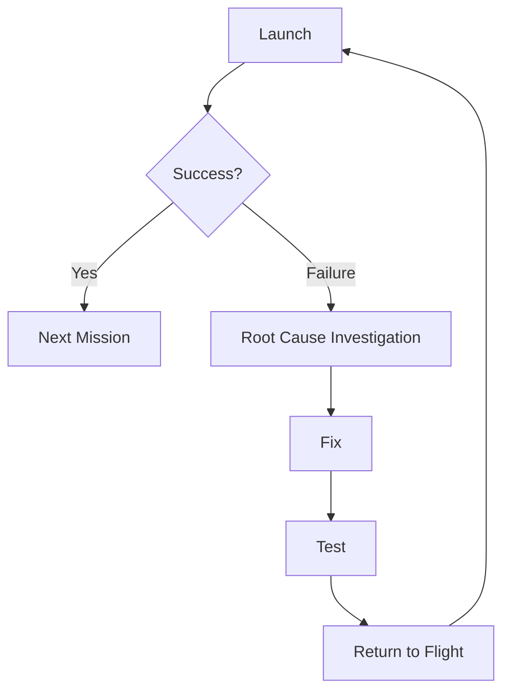

# Failures Recovery and Lessons Learned

> **SpaceX treats failure not as a program-ending catastrophe but as the fastest source of engineering data — a philosophy that has allowed the company to recover from every major setback stronger than before.**

## 🎯 Intuition
**The Core Idea:** SpaceX uses failures as compressed learning cycles rather than treating them as reasons to stop the program.
**Analogy:** It works like a lab that runs dangerous but informative experiments: each failed trial is costly, but it reveals exactly what to fix next.
**Why It Matters:** Traditional aerospace often turns major failures into multi-year pauses with huge bureaucratic and financial costs. SpaceX instead tries to identify the root cause quickly, implement a specific fix, and return to flight fast enough that failure becomes a temporary setback rather than a fatal blow.

## ⚙️ Core Mechanics
### Key Facts
- **Falcon 1 Flight 1** (March 24, 2006): Engine fire from a corroded fuel line nut; vehicle lost at T+33 seconds.
- **Falcon 1 Flight 2** (March 21, 2007): Second-stage roll instability and fuel slosh; reached space but failed to orbit.
- **Falcon 1 Flight 3** (August 2, 2008): Stage re-contact caused by residual Merlin 1C thrust after separation.
- **Flight 4 response**: SpaceX added a longer coast phase between stage-separation events, and Flight 4 succeeded seven weeks later.
- **CRS-7** (June 28, 2015): Second-stage breakup at T+139 seconds after a 2-foot steel strut failed at roughly one-fifth its rated load, releasing a helium COPV and causing overpressurization.
- **CRS-7 fix**: SpaceX introduced 100% incoming inspection of all safety-critical struts and redesigned the COPV mounting scheme.
- **AMOS-6** (September 1, 2016): Pad explosion during static fire after a COPV inside the second-stage LOX tank buckled and breached, likely due to oxygen pooling in the carbon fiber overwrap at cryogenic temperatures.
- **AMOS-6 fix**: SpaceX redesigned loading procedures and later introduced a COPV version 2.0 with improved thermal characteristics.
- **Falcon 9 cadence**: SpaceX returned to flight within four months of CRS-7 and five months after AMOS-6, averaging about 4.5 months after major Falcon 9 failures.
- **Starship IFT-1** (April 20, 2023): Multiple Raptor failures, failed stage separation, FTS activation at T+4 minutes, and severe pad damage.
- **Starship IFT-2** (November 18, 2023): First successful stage separation; booster RUD during boostback and ship lost near end of burn.

### Failure-to-Fix Pattern
The Falcon 1 program established the model. Flights 1 through 3 each failed for different reasons, and each failure produced a discrete engineering correction before the next attempt. SpaceX later repeated the same pattern on Falcon 9 and then at much larger scale on Starship, where destructive testing is even more central to the development strategy.

| Failure Event | Date | Root Cause | Corrective Action | Return to Flight |
|---|---|---|---|---|
| Falcon 1 Flight 1 | March 2006 | Corroded fuel line nut → engine fire | Redesigned fittings; new inspection protocols | March 2007 (~12 months) |
| Falcon 1 Flight 2 | March 2007 | Roll instability / fuel slosh on Stage 2 | Propellant management redesign | August 2008 (~17 months) |
| Falcon 1 Flight 3 | August 2008 | Residual Merlin 1C thrust → stage re-contact | Added coast phase before Stage 2 ignition | September 2008 (~7 weeks) |
| CRS-7 (Falcon 9) | June 2015 | Substandard strut failed → COPV release → overpressure | 100% strut acceptance testing; COPV redesign | December 2015 (~6 months) |
| AMOS-6 (Falcon 9) | September 2016 | COPV buckle in LOX tank during fueling | New COPV design; revised loading procedures | January 2017 (~5 months) |
| Starship IFT-1 | April 2023 | Multiple Raptor failures; inadequate pad protection | Raptor reliability upgrades; steel flame deflector with water deluge | November 2023 (~7 months) |
| Starship IFT-2 | November 2023 | Booster RUD during boostback; ship FTS late in burn | Filter redesign in LOX system; hot-staging improvements | March 2024 (~4 months) |

### Mermaid Diagram

## 🔬 Deep Dive
### Why SpaceX Fails Differently
SpaceX's philosophy differs from legacy aerospace less in its willingness to accept failure than in its ability to operationalize learning from it. In more traditional programs, a launch failure often triggers years of investigation, hearings, supplier negotiations, and schedule slips. SpaceX compresses that cycle by building organizational systems that rapidly isolate root causes, implement design changes, and get back to flight testing.

Falcon 1 showed the pattern early. Flight 1 in March 2006 failed because a corroded aluminum fuel line nut caused an engine fire, which led SpaceX to redesign fittings and tighten inspection protocols. Flight 2 in March 2007 exposed second-stage roll-control and fuel slosh problems, driving a propellant-management redesign. Flight 3 in August 2008 revealed a new issue created by the upgraded Merlin 1C engine: residual thrust caused stage-separation re-contact. SpaceX changed the sequence by adding a longer coast phase, and Flight 4 succeeded only seven weeks later.

The same model scaled up on Falcon 9. CRS-7 on June 28, 2015 broke apart 139 seconds into flight after a 2-foot steel strut failed far below its rated capacity and released a helium COPV, rapidly overpressurizing the stage. SpaceX responded with 100% inspection of critical struts and changes to COPV mounting. AMOS-6 on September 1, 2016 was lost on the pad during a static fire after a COPV inside the LOX tank buckled and breached, likely because oxygen pooled within the carbon overwrap under cryogenic conditions. That drove major revisions to fueling procedures and eventually a new COPV 2.0 design. The key result was speed: Falcon 9 came back in months, not years.

Starship extends this philosophy to full-scale experimental iteration. IFT-1 on April 20, 2023 suffered multiple Raptor failures, failed to stage, activated the flight termination system at T+4 minutes, and heavily damaged the pad. IFT-2 on November 18, 2023 achieved first-time stage separation, but the booster suffered a rapid unscheduled disassembly during boostback and the ship was lost near the end of its burn. Even so, these flights generated data that ground testing alone would have taken far longer to produce. The hardware cost is high, but the time cost is lower — and in launch development, time often matters most.

### Comparison with Alternatives

| Dimension | SpaceX Failure Model | Traditional Aerospace Model |
|---|---|---|
| View of failure | High-value engineering data if contained and understood | Major anomaly with long institutional consequences |
| Investigation tempo | Fast root-cause analysis and targeted redesign | Longer, more procedural, more fragmented reviews |
| Supply-chain response | Easier to change quickly through vertical integration | Slower due to subcontract coordination |
| Return-to-flight goal | Months when possible | Often 1–2 years after major failures |
| Test philosophy | Fly full systems early to expose unknowns | Heavier emphasis on exhaustive preflight qualification |
| Starship implication | Destructive test flights are expected in early development | Equivalent loss rates usually politically unacceptable |

## 🏋️ Practice
### Warm-Up — 3 Conceptual Questions
1. Why does SpaceX treat failure as a source of engineering data instead of only as a loss event?
2. What does the Falcon 1 sequence reveal about how SpaceX turns specific failures into specific fixes?
3. Why does vertical integration make rapid failure recovery easier?

### Core Analysis — 2 "What If" Scenarios
1. What if CRS-7 had occurred in a program with much less control over suppliers and manufacturing — how might the recovery timeline have changed?
2. What if Starship adopted a much more conservative, lower-flight-rate development model — what learning would likely be delayed?

### Challenge
1. Compare Falcon 1 Flight 3, CRS-7, and AMOS-6 as examples of different failure classes, and explain how each one required a different corrective-action strategy.

## See Also

- [[Falcon 1 Program]]
- [[Integrated Flight Tests]]
- [[SpaceX Culture and Operations]]
- [[Key Milestones Timeline]]

## References

→ [[SpaceX/Sources/Sources Index|Sources Index]]
