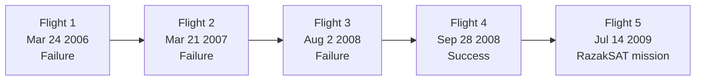

# Falcon 1 Program

> **Falcon 1 was SpaceX's first orbital launch vehicle — a small, two-stage rocket designed to prove that a private startup could reach orbit at a fraction of traditional costs.**

## 🎯 Intuition
**The Core Idea:** Falcon 1 was SpaceX's minimum viable orbital rocket and the company's first real proof that private launch development could work.
**Analogy:** It was the startup prototype that had to function in the real world before the company could build bigger, more ambitious products.
**Why It Matters:** Falcon 1 was not just an early rocket; it was a survival test for SpaceX itself. Its failures created the engineering and organizational habits that later powered Falcon 9 and beyond, and its eventual success validated the company's cost, integration, and test philosophy.

## ⚙️ Core Mechanics
### Key Facts
- **Mission role**: SpaceX's first orbital launch vehicle and first serious demonstration of low-cost private orbital access.
- **Design goal**: Build the world's lowest-cost orbital rocket and undercut competitors by 3–5× while still making positive margins through vertical integration.
- **Configuration**: Two-stage rocket using a single Merlin 1A engine on the first stage for Flights 1–2, upgraded to Merlin 1C for Flights 3–5.
- **Second stage**: Kestrel engine — pressure-fed, ablatively cooled, producing 31 kN thrust.
- **Size**: 21 meters (68 ft) tall and 1.7 meters in diameter.
- **LEO payload capacity**: Approximately 670 kg.
- **Target launch price**: ~$6.7 million per launch.
- **Launch site**: Ronald Reagan Ballistic Missile Defense Test Site on Omelek Island, Kwajalein Atoll, Marshall Islands.
- **Logistics challenge**: The remote equatorial site simplified range safety and offered launch advantages, but all hardware had to be shipped or airlifted thousands of miles and teams worked with minimal infrastructure in tropical heat.
- **Flight 1 failure** (March 24, 2006): Corroded aluminum fuel line nut caused an engine fire at T+33 seconds.
- **Flight 2 failure** (March 21, 2007): Second-stage roll instability and fuel slosh led to premature shutdown after reaching space.
- **Flight 3 failure** (August 2, 2008): Residual first-stage thrust from Merlin 1C caused stage re-contact after separation.
- **Flight 4 success** (September 28, 2008): First privately developed liquid-fueled rocket to reach Earth orbit.
- **Flight 5** (July 14, 2009): Delivered RazakSAT (180 kg) to a 685 km near-equatorial orbit and became the program's only commercial mission.

### Program and Flight Progression
Falcon 1 was deliberately small, but it carried a huge burden: it had to prove SpaceX could design, manufacture, launch, diagnose failures, and eventually reach orbit. The program moved through five flights, with the first three failing for different reasons before the fourth finally succeeded and the fifth flew the program's only commercial payload.

| Flight | Date | Outcome | Key Detail |
|---|---|---|---|
| Flight 1 | March 24, 2006 | Failure | Engine fire caused by corroded fuel line nut; lost at T+33s |
| Flight 2 | March 21, 2007 | Failure | Second-stage roll instability and fuel slosh; reached space but not orbit |
| Flight 3 | August 2, 2008 | Failure | Residual Merlin 1C thrust caused stage collision after separation |
| Flight 4 | September 28, 2008 | Success | First privately developed liquid-fueled rocket to orbit |
| Flight 5 | July 14, 2009 | Success | RazakSAT (180 kg) delivered to 685 km near-equatorial orbit |

### Mermaid Diagram

## 🔬 Deep Dive
### Why Falcon 1 Was Existential
Falcon 1 was conceived as SpaceX's minimum viable product for orbital access. Rather than beginning with a large launcher, SpaceX chose a small two-stage vehicle that could test the company's engineering, manufacturing, and operations model under real flight conditions. The business case depended on vertical integration and low price: at about $6.7 million per launch, Falcon 1 aimed to offer orbital access far below the cost structure of many competitors.

The operational environment amplified the challenge. Launching from Omelek Island in Kwajalein Atoll provided an equatorial advantage and simplified range safety, but the location was punishingly remote. Hardware and people had to move thousands of miles, support infrastructure was minimal, and teams often slept in the launch facility while working in tropical conditions. Falcon 1 was therefore a logistics stress test as well as a propulsion and structures program.

Its defining story is the sequence of three failures followed by success. Flight 1 on March 24, 2006 failed 33 seconds after liftoff because a corroded fuel line nut triggered an engine fire. Flight 2 on March 21, 2007 reached space but failed to achieve orbit because of second-stage roll-control and fuel slosh issues. Flight 3 on August 2, 2008 was especially devastating because SpaceX was nearing bankruptcy; the upgraded Merlin 1C introduced residual thrust that led to stage re-contact after separation. Flight 4 on September 28, 2008 finally achieved orbit, making Falcon 1 the first privately developed liquid-fueled rocket to do so. Flight 5 on July 14, 2009 then delivered RazakSAT to a 685 km near-equatorial orbit, completing the program's only commercial mission.

Falcon 1 mattered beyond its own modest performance. Musk has said SpaceX originally had funds for three flights and only managed to scrape together enough for a fourth. If Flight 4 had failed, the company likely would have collapsed. Instead, the program proved that a startup could build an orbital rocket from scratch, that iterative flight testing could work, and that vertically integrated launch development could materially reduce cost. The Merlin lineage, launch discipline, and failure-investigation culture established here became the foundation for Falcon 9.

### Comparison with Alternatives

| Attribute | Falcon 1 | Pegasus (Orbital Sciences) | Electron (Rocket Lab) |
|---|---|---|---|
| First orbital flight | 2008 | 1990 | 2018 |
| Launch method | Ground-launched | Air-launched from L-1011 | Ground-launched |
| LEO payload | ~670 kg | ~443 kg | ~300 kg |
| Engine cycle | Gas-generator (Merlin) | Solid-fueled stages | Electric pump-fed |
| Price per launch | ~$6.7M (target) | ~$40–56M | ~$7.5M |
| Total flights | 5 | 45+ | 50+ (ongoing) |
| Reusability | None | None | Partial (in development) |

## 🏋️ Practice
### Warm-Up — 3 Conceptual Questions
1. Why was Falcon 1 described as SpaceX's minimum viable product for orbital launch?
2. How did the Omelek Island launch site both help and hurt the program?
3. Why was Flight 4 more than just a technical success for SpaceX?

### Core Analysis — 2 "What If" Scenarios
1. What if Falcon 1 had been designed as a larger and more complex vehicle from the start — how might that have changed risk and cost?
2. What if Flight 3 had succeeded and Flight 4 had never been needed — which lessons from near-failure might SpaceX have missed organizationally?

### Challenge
1. Explain how Falcon 1's engine evolution, failure sequence, and operations model together laid the groundwork for Falcon 9.

## References

→ [[SpaceX/Sources/Sources Index|Sources Index]]
