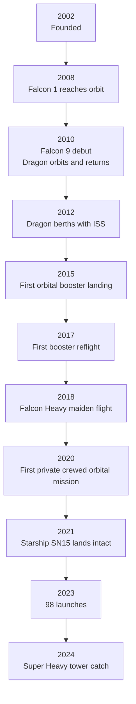

# Key Milestones Timeline

> **A chronological record of SpaceX's most significant firsts, records, and turning points from founding through the present era of Starship development.**

## 🎯 Intuition
**The Core Idea:** SpaceX's timeline shows a pattern of building one capability, operationalizing it, and then using it to unlock the next one faster.
**Analogy:** It is like a ladder where each rung is not just a one-time achievement but a platform for climbing more quickly to the next level.
**Why It Matters:** The milestone sequence captures the company's strategic arc: first prove orbital launch, then win commercial missions, then make reuse routine, then carry crew, then push toward Mars-class systems. The shortening intervals between milestones also show how iteration speed and reusability compound over time.

## ⚙️ Core Mechanics
### Key Facts
- **Strategic sequence**: Falcon 1 proved orbital capability, Falcon 9 and Dragon captured major commercial and NASA roles, booster landings enabled reuse, Crew Dragon certified private crew transport, and Starship / Super Heavy became the Mars-architecture path.
- **Launch cadence growth**: SpaceX flew 2 launches in 2013, 26 in 2020, and 98 in 2023 — about one mission every 3.7 days.
- **Reusability effect**: By 2023, individual Falcon 9 first stages had flown 19+ times and operational reuse had become routine.
- **Fastest turnaround**: A Falcon 9 booster was reflown within about 21 days in 2023.
- **Most-flown boosters**: B1058 and B1060 each exceeded 19 flights.
- **Starlink scale**: More than 6,000 satellites had been deployed by the end of 2024, the largest satellite constellation ever.

### Major Milestones

| Date | Milestone |
|---|---|
| June 2002 | SpaceX founded by Elon Musk in El Segundo, California |
| Sept 28, 2008 | Falcon 1 Flight 4 — first privately developed liquid-fueled rocket reaches orbit |
| June 4, 2010 | Falcon 9 v1.0 inaugural flight (Dragon Spacecraft Qualification Unit) |
| Dec 8, 2010 | Dragon becomes the first privately developed spacecraft to orbit and return to Earth (COTS Demo 1) |
| May 25, 2012 | Dragon berths with the ISS — first private spacecraft to visit the station (COTS Demo 2+) |
| Sept 29, 2013 | Falcon 9 v1.1 launches from Vandenberg — first flight with upgraded Merlin 1D engines |
| Dec 21, 2015 | Falcon 9 first stage (B1019) lands vertically at LZ-1, Cape Canaveral — first orbital-class booster landing |
| April 8, 2016 | First booster landing on a drone ship (*Of Course I Still Love You*) during CRS-8 mission |
| March 30, 2017 | SES-10 mission — first reflight of an orbital-class booster (B1021) |
| Feb 6, 2018 | Falcon Heavy maiden flight — most powerful operational rocket; both side boosters land simultaneously |
| March 2, 2019 | Crew Dragon Demo-1 — uncrewed flight to ISS, validates human-rating |
| May 30, 2020 | Crew Dragon Demo-2 — first crewed orbital mission by a private company (Bob Behnken & Doug Hurley) |
| May 5, 2021 | Starship SN15 — first Starship prototype to land intact after high-altitude flight |
| 2023 (full year) | 98 total launches — more than any country or entity; highest annual cadence in history |
| Oct 13, 2024 | Super Heavy booster caught by launch tower ("chopstick" arms) on Starship Flight 5 |

### Mermaid Diagram

## 🔬 Deep Dive
### The Arc of Capability Compression
SpaceX's history is best understood as a compression of development timelines. Instead of spending decades moving from one national-scale capability to another, the company advanced through a sequence of milestones in years: orbital launch, orbital spacecraft recovery, ISS servicing, reusable booster operations, human spaceflight, and now super-heavy full-stack development. That pace did not come from skipping technical steps. It came from running more iterations, taking controlled risk, and converting early breakthroughs into reusable operating capability.

The sequence begins in June 2002 with the company's founding. Falcon 1 Flight 4 on September 28, 2008 proved that a private company could build and fly a liquid-fueled orbital rocket. Falcon 9 then began expanding the capability base: its inaugural flight on June 4, 2010 established the larger launcher, and Dragon's December 8, 2010 COTS Demo 1 became the first privately developed spacecraft to orbit and return to Earth. Dragon's berthing with the ISS on May 25, 2012 pushed the company from launch provider to station logistics partner.

The next phase was the reusability transition. Falcon 9 v1.1 flew on September 29, 2013 with upgraded Merlin 1D engines, setting up the performance needed for recovery work. The first orbital-class booster landing came on December 21, 2015 at LZ-1, followed by the first drone-ship landing on April 8, 2016 during CRS-8. The breakthrough became operational when SES-10 launched on March 30, 2017 using the first reflown orbital-class booster, B1021. That shift eventually enabled the 2023 cadence of 98 launches, about one mission every 3.7 days, with individual boosters flying 19 or more times and one reflown in roughly 21 days.

Crew and heavy-lift milestones followed. Falcon Heavy's maiden flight on February 6, 2018 demonstrated the most powerful operational rocket of the time and landed both side boosters simultaneously. Crew Dragon Demo-1 on March 2, 2019 validated the system for human-rating, and Demo-2 on May 30, 2020 carried Bob Behnken and Doug Hurley, becoming the first crewed orbital mission by a private company. In parallel, Starship development accelerated: SN15 landed intact on May 5, 2021, and by October 13, 2024 SpaceX had caught a Super Heavy booster with launch tower arms on Flight 5. By the end of 2024, Starlink had also grown beyond 6,000 satellites, reinforcing the economic base that funds further iteration.

These milestones matter not just internally. They forced competitors and governments to react. ULA pursued Vulcan, Arianespace accelerated Ariane 6, and China's commercial launch sector increasingly mirrored Falcon 9-like architecture. SpaceX's timeline is therefore both a company history and a map of industry-wide inflection points.

### Comparison with Alternatives

| Milestone Category | SpaceX First Achieved | Nearest Comparable |
|---|---|---|
| Private orbital rocket | 2008 (Falcon 1) | Rocket Lab Electron, 2018 |
| Orbital booster landing | Dec 2015 (Falcon 9) | Blue Origin (suborbital), Nov 2015 |
| Orbital booster reuse | March 2017 (SES-10) | No equivalent until Electron recovery attempts, 2020+ |
| Private crew to ISS | May 2020 (Demo-2) | Boeing Starliner crewed, June 2024 |
| Super-heavy booster catch | Oct 2024 (Starship IFT-5) | No equivalent attempted |
| 90+ launches in one year | 2023 (98 launches) | China total: ~67; all others combined: ~40 |

## 🏋️ Practice
### Warm-Up — 3 Conceptual Questions
1. Why does the SpaceX milestone sequence show more than just isolated technical successes?
2. How did booster landing and reuse change the meaning of later launch-cadence numbers?
3. Why is Dragon's ISS berthing a qualitatively different milestone from simply reaching orbit?

### Core Analysis — 2 "What If" Scenarios
1. What if booster landing had succeeded but reflight had not become routine — how would the 2023 launch cadence likely have changed?
2. What if Crew Dragon had been delayed by several more years — how might that have affected SpaceX's place in the broader industry timeline?

### Challenge
1. Trace the causal chain from Falcon 1 Flight 4 in 2008 to the 2024 Super Heavy tower catch, explaining which milestones created the conditions for the ones that followed.

## References

→ [[SpaceX/Sources/Sources Index|Sources Index]]
