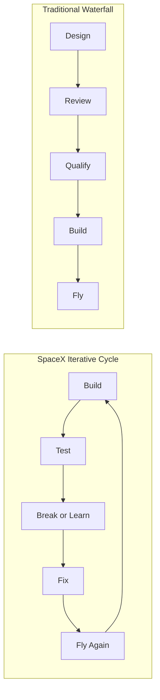

# SpaceX Culture and Operations

> **SpaceX's organizational culture — characterized by vertical integration, rapid iteration, flat hierarchy, and extreme work intensity — is a primary competitive advantage that enables development speeds unmatched by traditional aerospace.**

## 🎯 Intuition
**The Core Idea:** SpaceX's culture is designed to shorten the distance between idea, hardware, test, failure, and redesign.
**Analogy:** It works like a tightly packed workshop where the designer, machinist, and operator stand a few steps apart instead of being scattered across an entire bureaucracy.
**Why It Matters:** SpaceX's speed is not just about talented engineers or bold leadership; it comes from a system built to compress feedback loops. That system changes cost, schedule, and learning rate, which is why culture and operations function as a real engineering advantage rather than a soft background factor.

## ⚙️ Core Mechanics
### Key Facts
- **Hawthorne HQ**: About 550,000 sq ft at 1 Rocket Road, Hawthorne, California, combining design, manufacturing, and mission control.
- **Physical co-location**: Engineers can move directly between design offices, factory floor, and mission control, reducing communication lag.
- **Vertical integration**: About 80–85% of components are built in-house, including Merlin and Raptor engines, avionics, flight software, fairings, Dragon capsules, and Crew Dragon astronaut suits.
- **Supplier substitution**: When outside quotes for a needed carbon fiber grade were too high, SpaceX built its own carbon fiber production capability.
- **Raptor production**: By late 2023, SpaceX was producing roughly one Raptor engine every 48 hours.
- **Workforce (2024)**: More than 13,000 employees across Hawthorne, McGregor, Cape Canaveral, Vandenberg, Starbase, and Redmond.
- **Hiring philosophy**: Generalists with hands-on problem-solving ability are favored over narrow specialists; interviews are known for fabrication and design challenges.
- **Work culture**: 60–80 hour weeks are common, especially during launch campaigns; burnout is high, but mission-driven retention is also strong.
- **Flat hierarchy**: Engineers often interact directly with VP-level leadership, and Musk participates in technical design reviews.
- **Starbase iteration**: More than a dozen Starship prototypes were built and tested, many to destruction, between 2020 and 2023.

### Operating Model in Practice
SpaceX's culture combines physical co-location, vertical integration, and iterative testing into one operating model. Instead of separating design, manufacturing, review, and operations into slow handoffs, it tries to keep them in constant contact. The result is a company that behaves more like a hardware-heavy software startup than a classic defense contractor.

| Mechanism | Operational Effect |
|---|---|
| Co-located HQ | Faster feedback between design, manufacturing, and flight operations |
| 80–85% in-house manufacturing | Lower supplier dependency, shorter lead times, more design control |
| Flat hierarchy | Faster decisions and fewer approval layers |
| Test-to-destruction mindset | Reveals unknown failure modes earlier |
| High-intensity workforce | Increases pace, though at the cost of burnout risk |

### Mermaid Diagram

## 🔬 Deep Dive
### Why the Organization Is Part of the Product
SpaceX operates more like a Silicon Valley software company than a traditional aerospace prime, but in a domain where hardware failure is unforgiving. Its Hawthorne headquarters, a former Boeing 747 fuselage factory, places design, manufacturing, and mission control under one roof. That arrangement is intentional. Engineers who design a part can walk to the factory floor to see it built and then move to mission control to watch it operate in flight. By compressing those loops physically, the company avoids much of the communication overhead that slows distributed aerospace programs.

Vertical integration is the backbone of this system. SpaceX manufactures around 80–85% of rocket components internally, including engines, avionics, flight computers, fairings, Dragon hardware, and even astronaut suits. When supplier pricing for a needed carbon fiber grade was unattractive, the company internalized that capability. This "make, don't buy" approach reduces markup, cuts lead time, and allows engineers to change hardware without waiting on long external coordination chains. Traditional contractors such as Boeing and Lockheed Martin usually depend on extensive subcontractor networks, which can increase cost and integration risk.

The development model is equally important. Rather than spending 5–7 years on design and reviews before cutting metal, SpaceX builds hardware early, tests it aggressively, and incorporates lessons quickly. Starship is the clearest example: more than a dozen prototypes were built and tested at Starbase between 2020 and 2023, many ending in destruction. That would be culturally abnormal in much of traditional aerospace, but at SpaceX the loss of hardware is treated as acceptable if it shortens the path to a working design. The company spends more on failed prototypes in the short term to reduce total schedule and to surface unknown-unknowns earlier.

This culture has direct strategic consequences. SpaceX moved through five major Falcon 9 versions in roughly eight years from 2010 to 2018, a pace many legacy programs would struggle to match. By late 2023, it was producing about one Raptor engine every 48 hours. By 2024, it employed more than 13,000 people across major sites in California, Texas, Florida, and Washington. The broader industry has responded: NASA and the U.S. Space Force increasingly rely on fixed-price models, and competitors such as Blue Origin, Relativity Space, and Rocket Lab have adopted parts of the vertical-integration and iterative-test playbook. SpaceX did not simply build rockets differently; it showed that the old organizational model was slower and more expensive than necessary.

### Comparison with Alternatives

| Dimension | SpaceX | Boeing / Lockheed Martin (Traditional) |
|---|---|---|
| Integration model | ~80–85% in-house | Heavy subcontracting (hundreds of suppliers) |
| Development method | Iterative: build → test → break → fix → fly | Waterfall: design → review → qualify → build → fly |
| Prototype philosophy | Build many, test to destruction | Build few, protect each unit |
| Decision speed | Engineers empowered; Musk reviews directly | Layered management approval chains |
| Facility layout | Design + factory + mission control co-located | Distributed across multiple states/sites |
| Contract preference | Fixed-price commercial | Cost-plus government |
| Risk tolerance for testing | High (accept RUDs as data) | Low (failure = program risk) |
| Typical development cycle | 3–5 years concept to flight | 7–15 years concept to flight |

## 🏋️ Practice
### Warm-Up — 3 Conceptual Questions
1. Why does co-locating design, manufacturing, and mission control change engineering speed?
2. How does vertical integration support both lower cost and faster iteration?
3. Why is SpaceX's culture described as part of its competitive advantage rather than just a management style?

### Core Analysis — 2 "What If" Scenarios
1. What if SpaceX outsourced most of its major systems to a large supplier network — how would that likely affect design iteration and lead times?
2. What if SpaceX adopted a more traditional low-risk qualification process before flying prototypes — what would probably happen to Starship development speed?

### Challenge
1. Explain how SpaceX's co-location, vertical integration, and test philosophy reinforce one another, and contrast that system with the traditional aerospace waterfall model.

## References

→ [[Sources Index]]
