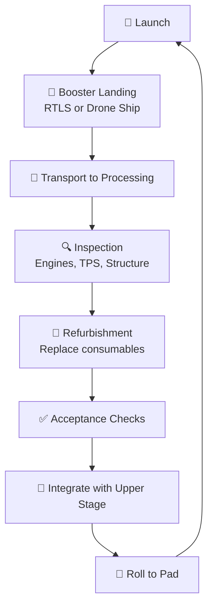

# Booster Recovery and Reflight

> **Booster recovery and reflight is SpaceX's end-to-end process for turning a landed Falcon 9 first stage around from touchdown back to the launch pad for another mission.**

## 🎯 Intuition
**The Core Idea:** Recovering a booster is only half the equation—reflying it quickly, safely, and affordably is what turns a landing into an economic revolution.
**Analogy:** Reusability = airline economics — amortize the aircraft (booster) cost over hundreds of flights instead of scrapping it after one trip.
**Why It Matters:** A booster that lands once and never flies again saves nothing. Reflying the same hardware dozens of times amortizes manufacturing cost across many missions, dramatically reducing the marginal cost per launch and enabling SpaceX's high-cadence manifest of 90+ launches per year.

## ⚙️ Core Mechanics
### How It Works

| Phase | Activity |
|---|---|
| Landing | RTLS to ground pad or ASDS drone ship |
| Safing | Residual propellant venting, power-down |
| Transport | Barge tow or road transport to processing facility |
| Inspection | Engines, turbopumps, thrust structure, tanks, grid fins, TPS |
| Refurbishment | Replace consumables (pyro stage-sep hardware, gas generator igniters, select seals) |
| Acceptance | Functional checks, engine health verification |
| Integration | Mate with new upper stage and payload |
| Rollout | Transport to pad for next mission |

### Key Facts
- First-ever reflight of an orbital-class booster: B1021 on SES-10, March 30, 2017
- Block 5 (introduced May 2018): designed for 10+ flights with minimal refurbishment, up to 100 flights with overhaul
- Fleet leaders B1058, B1060, and B1061 each exceeded 20 flights as of 2024–2025
- Turnaround reduced from ~12 months (2017) to ~3–4 weeks (2023–2025); fastest was ~21 days
- Post-landing inspections focus on engines, turbopumps, thrust structure, tanks, grid fins, and TPS
- Consumables replaced: pyrotechnic stage-separation hardware, gas generator igniters, select seals
- No mission failure attributed to booster reuse as of mid-2025
- Block 5 engines rated for at least 10 flights without major overhaul; TPS more durable; octaweb more inspection-friendly

### Recovery-to-Reflight Cycle

## 🔬 Deep Dive
### Engineering Details
In the early years of the reuse program (2017–2018), turnaround from landing to relaunch took months—the first reflight of B1021 on SES-10 in March 2017 came roughly a year after its initial flight. As SpaceX matured the Block 5 design, turnaround times compressed dramatically. Block 5 was explicitly designed for rapid reuse: engines rated for at least 10 flights without major overhaul, a more durable thermal protection system, and a more inspection-friendly octaweb structure. By 2022–2023, SpaceX achieved turnaround times of ~21 days and demonstrated sub-month cadence routinely.

Building customer trust was gradual. Early reflight customers received significant discounts to accept a "flight-proven" booster. Over time, as the fleet accumulated hundreds of successful reflights with no reuse-attributable failures, pre-flown boosters became the norm. Today, most commercial and NASA missions fly on boosters with multiple prior flights.

### Comparison — Expendable vs. Reused

| Aspect | Expendable Flight | Reused Booster Flight |
|---|---|---|
| Booster status after mission | Destroyed | Recovered for next flight |
| Per-launch hardware cost | Full build cost (~$30–35M stage) | Marginal refurb cost (~$10–15M est.) |
| Payload to orbit | Maximum (no fuel reserved) | Slightly reduced (landing fuel reserved) |
| Customer pricing (historical) | Premium | Initially discounted, now standard |

### Reflight Milestones

| Milestone | Booster | Date | Detail |
|---|---|---|---|
| First reflight | B1021 | March 30, 2017 | SES-10 mission |
| First Block 5 reflight | B1046 | November 15, 2018 | Es'hail-2 mission |
| Fastest turnaround | B1058 | ~21 days | Between Starlink missions |
| First booster to 10 flights | B1058 | May 2021 | Starlink mission |
| First booster to 20 flights | B1058 | 2023 | Starlink mission |

## 🏋️ Practice
### Warm-Up — 3 Conceptual Questions
1. Why does Block 5's design target of "10 flights without major overhaul" matter more for economics than the theoretical "100 flights with overhaul" figure?
2. What specific engineering changes in Block 5 (vs. earlier blocks) enabled sub-month turnaround times?
3. Why was building customer trust for flight-proven boosters a gradual process, and what milestone pattern finally normalized it?

### Core Analysis — 2 "What If" Scenarios
1. What if SpaceX had achieved booster landing but never reduced turnaround below 6 months? How would that change their launch economics and market position vs. expendable competitors?
2. What if a mission failure were attributed to booster reuse — how would that affect the reflight program, customer confidence, and pricing strategy?

### Challenge
1. Calculate the break-even point: given a ~$30–35M booster build cost and ~$10–15M marginal reflight cost, after how many reflights does the per-flight hardware cost drop below $5M? What does this imply for SpaceX's profit margin at $67M list price?

## References

→ [[SpaceX/Sources/Sources Index|Sources Index]]
