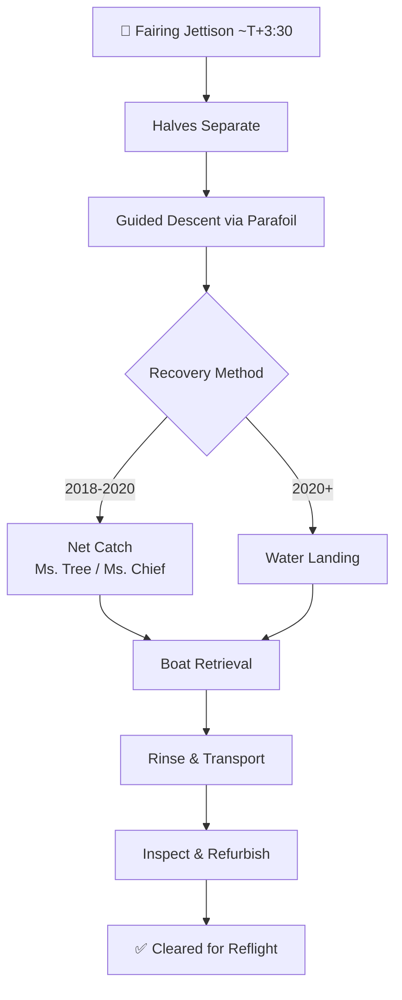

# Fairing Recovery and Reuse

> **Fairing recovery and reuse is SpaceX's program to retrieve, refurbish, and refly the Falcon 9 payload fairing halves—carbon-fiber composite shells that protect the payload during ascent and cost roughly $6 million per set.**

## 🎯 Intuition
**The Core Idea:** The payload fairing—a $6M carbon-fiber nose cone—was traditionally thrown away after every launch; SpaceX figured out how to fish it out of the ocean and fly it again.
**Analogy:** Throwing away a fairing each flight is like discarding first-class cabin walls after every airline flight — expensive, wasteful, and unnecessary once you learn to recover them.
**Why It Matters:** The fairing accounts for ~10% of Falcon 9 vehicle cost. Recovering and reflying fairings complements booster reuse, moving SpaceX closer to reusing every major component and reinforcing their economic moat against expendable competitors.

## ⚙️ Core Mechanics
### Key Specifications

| Parameter | Value |
|---|---|
| Fairing cost per set | ~$6 million (~10% of Falcon 9 launch price) |
| Material | Carbon fiber composite |
| Dimensions | 13.1 m tall × 5.2 m diameter |
| Jettison time | ~T+3:30 (above dense atmosphere) |
| Recovery method (2018–2020) | Net catch via Ms. Tree / Ms. Chief |
| Recovery method (2020+) | Controlled water landing + boat retrieval |
| Design variant | Fairing 2.0 (paired with Block 5) |

### Key Facts
- Each fairing set costs approximately $6 million—about 10% of a Falcon 9 launch price
- Fairings are carbon fiber composite: 13.1 m tall, 5.2 m diameter
- Recovery boats Mr. Steven/Ms. Tree and Ms. Chief used for net-catch attempts from 2018–2020
- First successful net catch of a fairing half: June 2019
- SpaceX transitioned to water-landing recovery due to higher reliability
- First reflight of a recovered fairing: Starlink v1.0 L2 mission, January 2020
- Fairing 2.0 introduced alongside Block 5: upgraded thermal protection, more robust separation mechanisms, better sealing against water ingress
- Reused fairings now routine on Starlink missions and increasingly on commercial flights

### Recovery Flow

## 🔬 Deep Dive
### Engineering Details
SpaceX's initial recovery concept involved equipping each fairing half with a parafoil guidance system and catching them in a large net on a fast-moving boat. Mr. Steven (later renamed Ms. Tree) and Ms. Chief were outfitted with outstretched nets. In practice, precision net catches proved extremely difficult due to wind variability, parafoil dynamics, and timing constraints. SpaceX achieved a handful of successful net catches in 2019–2020 but found that controlled water landings followed by boat retrieval were more reliable and scalable. The fairing halves, designed to float, are fished from the sea, rinsed of salt water, and returned for refurbishment.

The Fairing 2.0 design incorporated improvements for reusability: upgraded thermal protection, more robust separation mechanisms, and better sealing against water ingress. Refurbishment involves inspection of the composite structure for delamination or micro-cracking, replacement of separation hardware and degraded thermal protection material, and functional testing of deployment mechanisms.

### Comparison — New vs. Reused Fairing

| Aspect | New Fairing | Reused Fairing |
|---|---|---|
| Cost to SpaceX | ~$6M manufacturing | Refurbishment cost (fraction of new) |
| Structural risk | Factory-fresh composite | Inspected for micro-damage; cleared for flight |
| Customer acceptance | Standard | Initially limited; now widely accepted |
| Typical missions | High-value commercial / crew | Starlink, commercial |

### Recovery Milestones

| Milestone | Date | Detail |
|---|---|---|
| First fairing recovery attempt | 2017 | Parafoil-guided descent, ocean recovery |
| Mr. Steven net-catch attempts begin | 2018 | Modified fast supply vessel with net |
| First successful net catch | June 2019 | Single half caught by Ms. Tree |
| First reflight of reused fairing | January 2020 | Starlink v1.0 L2 mission |
| Net-catch program wound down | 2020–2021 | Water landing became primary method |
| Reused fairings become routine | 2021–present | Standard on most Starlink flights |

## 🏋️ Practice
### Warm-Up — 3 Conceptual Questions
1. Why did SpaceX abandon the technically impressive net-catch method in favor of simpler water landings, and what does this reveal about engineering trade-offs?
2. At $6M per set, how many fairing reflights does it take to meaningfully impact SpaceX's annual cost structure given 90+ launches per year?
3. What specific challenges does saltwater exposure create for carbon fiber composite structures, and how does Fairing 2.0 address them?

### Core Analysis — 2 "What If" Scenarios
1. What if SpaceX had never developed fairing recovery — how would the $6M-per-flight cost impact Starlink constellation economics over 1,000+ launches?
2. What if fairing halves could only survive 2–3 reflights before structural degradation? How would that change the cost-benefit calculus vs. manufacturing new fairings?

### Challenge
1. Design a decision matrix: under what wind, sea-state, and mission-timeline conditions should SpaceX attempt a net catch vs. a water landing vs. writing off the fairing as expendable? Identify the key variables and thresholds.

## References

→ [[SpaceX/Sources/Sources Index|Sources Index]]
