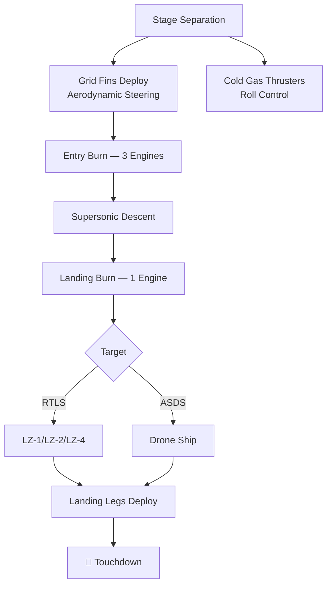

# Landing Hardware

> **Landing hardware encompasses the physical systems added to the Falcon 9 first stage and supporting infrastructure that enable controlled descent and precision vertical landing.**

## 🎯 Intuition
**The Core Idea:** Four hardware systems — grid fins, landing legs, cold gas thrusters, and drone ships — work together to steer, stabilize, and catch a returning booster.
**Analogy:** Think of grid fins as the steering wheel, cold gas thrusters as gyroscopic stabilizers, landing legs as the landing gear, and drone ships as aircraft carriers — each indispensable for a safe return.
**Why It Matters:** Without grid fins the stage cannot steer; without legs it cannot stand; without drone ships, high-energy missions cannot recover boosters at all. The Block 5 configuration represents the mature, reuse-optimized design enabling 20+ flights per booster.

## ⚙️ Core Mechanics
### Key Specifications

| Component | Material | Dimensions / Detail | Function | Reusability |
|---|---|---|---|---|
| Grid fins (Block 5) | Single-piece cast titanium | ~1.2 m × 0.9 m each | Aerodynamic pitch/yaw steering | Reused across many flights |
| Grid fins (pre-Block 5) | Cast aluminum | ~1.2 m × 0.9 m each | Aerodynamic steering | Single-use (ablation) |
| Landing legs | Carbon fiber / Al honeycomb | 4 deployable structures | Touchdown support | Reused with inspection |
| Cold gas thrusters | Nitrogen gas system | Near top of stage | Roll control in vacuum | Refilled between flights |

### Key Facts
- Grid fins upgraded from cast aluminum (pre-Block 5) to single-piece cast titanium (Block 5, 2018 onward)
- Titanium fins withstand reentry heating without ablation; aluminum fins required replacement after each flight
- Each grid fin is ~1.2 m × 0.9 m, rotatable for pitch/yaw control
- Landing legs are carbon fiber/aluminum honeycomb, deploy pneumatically once per flight; cannot be retracted
- Cold gas nitrogen thrusters provide three-axis attitude control during exoatmospheric coast phase
- Three operational drone ships: Of Course I Still Love You (OCISLY, East Coast), Just Read the Instructions (JRTI, West Coast), A Shortfall of Gravitas (ASoG, East Coast, added 2021)
- Drone ships use GPS-based stationkeeping thrusters to hold position within ±3 m despite ocean swells
- ASDS vessels are converted deck barges positioned hundreds of kilometers downrange

### Landing Sequence

## 🔬 Deep Dive
### Engineering Details
**Grid fins** are mounted near the top of the interstage and deploy after stage separation, acting as aerodynamic control surfaces that provide pitch and yaw authority throughout descent. Early Falcon 9 flights used cast aluminum fins that experienced surface ablation at hypersonic speeds and were not easily reusable. Block 5's single-piece cast titanium fins withstand reentry heating without ablation and offer better aerodynamic performance, though at higher upfront manufacturing cost.

**Landing legs** are four deployable structures stowed flush against the stage base during ascent. They deploy pneumatically moments before touchdown, extending outward to form a stable base. The carbon fiber and aluminum honeycomb construction minimizes mass while absorbing landing loads. Once deployed, legs cannot be retracted — the booster is transported with legs extended or removed.

**Cold gas nitrogen thrusters** near the top of the stage fire short bursts of pressurized nitrogen to maintain proper orientation during the coast phase, when aerodynamic surfaces are ineffective in near-vacuum.

**Autonomous Spaceport Drone Ships (ASDS)** are converted deck barges using GPS-based stationkeeping to hold position within a few meters. OCISLY was the first operational ASDS (Atlantic); JRTI serves Vandenberg (West Coast); ASoG was added to the East Coast fleet in 2021 to support increasing launch cadence.

### Comparison — RTLS vs. ASDS Landing

| Aspect | RTLS (Land Landing) | ASDS (Drone Ship Landing) |
|---|---|---|
| Landing surface | Reinforced concrete pad (LZ-1/LZ-4) | Steel deck barge at sea |
| Grid fin usage | Full authority (longer atmospheric flight) | Full authority |
| Leg deployment | Same | Same |
| Position stability | Fixed ground pad | GPS-thrusted stationkeeping (±3 m) |
| Booster fuel reserve | Higher (full boostback) | Lower (partial boostback) |
| Weather constraints | Standard ground ops | Ocean swell, wind limits apply |
| Recovery transport | Crane to transporter on-site | Towed to port over 2–3 days |

## 🏋️ Practice
### Warm-Up — 3 Conceptual Questions
1. Why did SpaceX accept the higher upfront cost of titanium grid fins for Block 5, and how does the trade-off change over 20+ flights?
2. What happens if one of four landing legs fails to deploy? What design margin exists for asymmetric touchdown?
3. Why are cold gas thrusters needed in addition to grid fins — at what altitude/speed regime does each system dominate?

### Core Analysis — 2 "What If" Scenarios
1. What if drone ships could hold position to ±0.5 m instead of ±3 m? How would that affect landing success rates and the precision required of onboard guidance?
2. What if SpaceX had chosen retractable landing legs (like aircraft gear) instead of single-deploy legs? Analyze the mass, complexity, and turnaround trade-offs.

### Challenge
1. ASoG was added in 2021 specifically to support higher launch cadence. Given that SpaceX launched 134 missions in 2024, estimate the minimum drone ship fleet size needed if each ship requires 2–3 days for booster return plus 1 day for repositioning, and 60% of missions use ASDS landings.

## References

→ [[SpaceX/Sources/Sources Index|Sources Index]]
