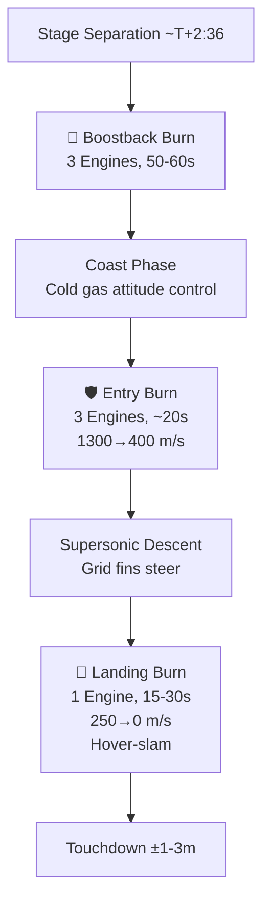

# Propulsive Landing Technology

> **Propulsive landing technology is the suite of techniques SpaceX developed to fly a Falcon 9 first stage back from the edge of space and land it vertically under its own engine power.**

## 🎯 Intuition
**The Core Idea:** SpaceX reignites the booster's engines three times during descent — boostback, entry, and landing — to guide a falling rocket stage to a precise vertical touchdown.
**Analogy:** Imagine throwing a ball straight up, then using a jetpack to reverse course, slow down through a wall of wind, and land on a dinner plate — that's supersonic retropropulsion at orbital scale.
**Why It Matters:** Propulsive landing is the enabling technology behind reusability economics. Without it, every first stage would be lost after a single flight. By recovering the most expensive component — worth ~60–70% of vehicle cost — SpaceX transformed the economics of spaceflight and forced the entire industry to pursue reusable architectures.

## ⚙️ Core Mechanics
### Three-Burn Descent Profile

| Burn Phase | Engines | Duration (approx.) | Speed Change | Purpose |
|---|---|---|---|---|
| Boostback | 3 Merlin 1D | 50–60 s | Reverse horizontal velocity | Redirect toward landing zone |
| Entry | 3 Merlin 1D | ~20 s | ~1,300 → ~400 m/s | Decelerate through upper atmosphere; thermal/aero shielding |
| Landing | 1 Merlin 1D | 15–30 s | ~250 → 0 m/s | Final deceleration to surface (hover-slam) |

### Key Facts
- Supersonic retropropulsion first demonstrated operationally by SpaceX; prior work limited to wind-tunnel studies and NASA research
- Boostback burn: 3 Merlin 1D engines, ~50–60 seconds
- Entry burn: 3 engines, ~20 seconds, reduces speed from ~1,300 m/s to ~400 m/s
- Landing burn: 1 engine, 15–30 seconds, decelerates from ~250 m/s to 0 m/s
- Landing accuracy: typically within 1–3 meters of pad center
- Single Merlin 1D at minimum thrust exceeds stage empty weight — cannot hover; must commit to a "hover-slam" burn reaching zero velocity exactly at ground level
- Guidance uses convex optimization algorithms computing fuel-optimal trajectories in real time, adjusting for winds, engine performance, and position errors
- First successful landing: Orbcomm OG-2, December 21, 2015 (RTLS to LZ-1, Cape Canaveral)
- First successful drone-ship landing: April 2016 (CRS-8 on Of Course I Still Love You)

### Descent Profile

## 🔬 Deep Dive
### Engineering Details
Traditional rocket stages are discarded after use, falling into the ocean as debris. SpaceX engineered the Falcon 9 first stage to reignite its Merlin engines at three critical descent points. The foundational physics challenge is supersonic retropropulsion: firing engines into an oncoming supersonic airstream. Before SpaceX demonstrated it operationally, supersonic retropropulsion had been studied theoretically but never attempted at orbital-class scale.

The entry burn creates a thermal and aerodynamic shock envelope that shields the engines and vehicle from extreme heating. The landing burn cannot be throttled to hover — the single Merlin 1D at minimum thrust still exceeds the stage's empty weight — so guidance must commit to a single continuous burn reaching zero velocity exactly at ground level. This precision is enabled by convex optimization guidance algorithms that compute fuel-optimal trajectories in real time, adjusting for winds, engine performance, and position errors.

SpaceX achieved the first successful orbital-class propulsive landing on December 21, 2015, when Falcon 9 flight 20 delivered the Orbcomm OG-2 constellation and the first stage returned to Landing Zone 1 at Cape Canaveral.

### Comparison — RTLS vs. ASDS

| Aspect | RTLS (Return to Launch Site) | ASDS (Drone Ship) |
|---|---|---|
| Landing location | Land pad near launch site | Autonomous drone ship downrange |
| Fuel cost | Higher (full boostback required) | Lower (partial trajectory reversal) |
| Payload penalty | ~30% reduction vs expendable | ~10–15% reduction vs expendable |
| Weather sensitivity | Lower (land-based pad) | Higher (ocean conditions affect ship stability) |
| Typical mission profile | LEO with margin, Starlink | GTO, heavy payloads, high-energy orbits |

## 🏋️ Practice
### Warm-Up — 3 Conceptual Questions
1. Why can't a single Merlin 1D hover the empty stage, and what does the "hover-slam" constraint imply for guidance software reliability?
2. The entry burn uses 3 engines but only lasts ~20 seconds — why is a short, high-thrust burn preferable to a longer, lower-thrust deceleration at this phase?
3. Why does an RTLS profile impose a ~30% payload penalty while an ASDS landing only costs ~10–15%?

### Core Analysis — 2 "What If" Scenarios
1. What if SpaceX had developed a deeply throttleable engine (say, 10% minimum thrust) that could hover? How would that change landing guidance complexity, propellant budget, and risk profile?
2. What if convex optimization guidance were replaced by pre-computed trajectory tables? Analyze the trade-offs in computational cost, adaptability to off-nominal conditions, and landing accuracy.

### Challenge
1. The boostback burn uses 3 engines for 50–60s, the entry burn 3 engines for ~20s, and the landing burn 1 engine for 15–30s. Given Merlin 1D's sea-level thrust of ~845 kN and specific impulse of ~282s, estimate the total propellant mass reserved for the landing sequence and express it as a percentage of the stage's ~433-tonne propellant load.

## See Also

- [[Grid Fins and Aerodynamic Control]]
- [[Booster Recovery and Reflight]]
- [[Reusability Economics]]
- [[Avionics and Flight Software]]

## References

→ [[SpaceX/Sources/Sources Index|Sources Index]]
