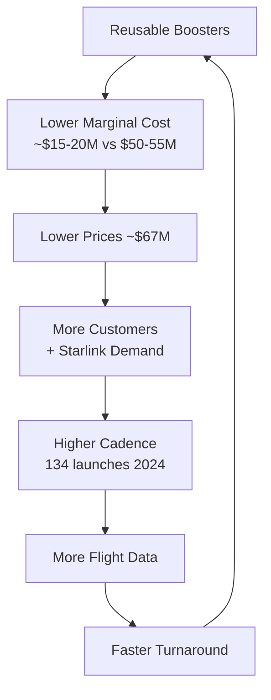

# Reusability Economics

> **Reusability economics describes how recovering and reflying rocket hardware transforms the cost structure of orbital launch, enabling SpaceX to offer prices that expendable competitors cannot match.**

## 🎯 Intuition
**The Core Idea:** By reflying the same booster 20+ times, SpaceX amortizes the ~$30–35M build cost across many missions, driving per-launch cost toward the marginal floor of propellant + operations.
**Analogy:** Reusability = airline economics — no airline builds a new Boeing 737 for every flight; amortize the aircraft cost over thousands of flights and per-trip cost approaches fuel + crew + maintenance.
**Why It Matters:** Without cost savings, landing a booster would be a stunt. With them, it is the foundation of a business model that has reshaped the space industry, enabled megaconstellations like Starlink, and made SpaceX the most prolific launch provider in history.

## ⚙️ Core Mechanics
### Cost Structure Breakdown

| Cost Element | Expendable Launch | Reusable Launch (SpaceX) |
|---|---|---|
| First stage hardware | Full build (~$30–35M) | Amortized over 15–20+ flights |
| Upper stage | Full build (~$10M) | Full build (not yet reused) |
| Fairing | Full build (~$6M) | Amortized over multiple flights |
| Propellant (RP-1 + LOX) | ~$200–300K | ~$200–300K |
| Operations & range | ~$5–10M | ~$5–10M |
| Estimated total cost per flight | ~$50–55M+ | ~$15–20M marginal |
| List price to customer | ~$60–70M | ~$67M (margin captured by SpaceX) |

### Key Facts
- Falcon 9 first stage: ~60–70% of vehicle cost (~$30–35M of ~$50–55M total hardware)
- Falcon 9 list price: ~$67M standard mission; internal marginal reflight cost: ~$15–20M
- Propellant cost (RP-1 + LOX): ~$200,000–$300,000 per flight — less than 1% of launch price
- Starlink program viable largely because internal launch costs are at marginal reflight rates
- Expendable competitors must amortize full manufacturing cost on every single flight
- Fairing reuse saves an additional ~$6M per flight
- Annual launch cadence exceeded 90 flights in 2024, enabled by low marginal cost of reuse
- Reuse cost advantage compounds: higher cadence → more learning → faster turnaround → lower costs

### Virtuous Cycle

## 🔬 Deep Dive
### Competitive Dynamics
The economic argument starts with a simple observation: on an expendable Falcon 9 launch priced at ~$67 million, the first stage accounts for ~60–70% of total vehicle cost, the upper stage ~20%, and the fairing ~10%. In expendable mode, 100% of hardware is destroyed every flight. Reusability flips this equation — the marginal cost of a reflight includes only refurbishment, propellant, range fees, and operations.

While a Falcon 9 booster flies 20+ times rather than an airliner's 20,000+, the principle holds: amortizing a fixed capital cost over many uses drives per-unit cost toward the marginal operating cost. The more flights per booster, the closer launch costs approach the theoretical floor of propellant + operations.

This cost structure has profound competitive effects. Expendable launch providers — Arianespace (Ariane 6), ULA (Vulcan), and others — must recover full manufacturing cost on every flight. Even if priced comparably to Falcon 9's list price, their actual per-flight costs remain far higher than SpaceX's marginal reflight cost. SpaceX can profitably underprice competitors or earn substantially higher margins at the same sticker price. This dynamic has driven SpaceX's share above 60% of global commercial launches and pressured every major launch provider to develop reusable systems.

### Comparison — Expendable vs. Reusable Economics

| Metric | Expendable Provider | SpaceX (Reusable) |
|---|---|---|
| Per-flight hardware cost | ~$50–55M (full build) | ~$15–20M (marginal reflight) |
| Propellant as % of cost | ~0.5% | ~1–2% (of marginal cost) |
| Margin at ~$67M price | Thin or negative | Substantial (~$45–50M gross) |
| Cadence scaling | Linear cost scaling | Sub-linear (amortization improves) |
| Market share trend | Declining | >60% of global commercial launches |

## 🏋️ Practice
### Warm-Up — 3 Conceptual Questions
1. Why is propellant cost (~$200–300K) almost irrelevant to the reusability economics argument, yet central to the theoretical cost floor?
2. How does SpaceX's Starlink internal demand create a flywheel effect that no competitor can replicate?
3. Why can't an expendable competitor simply match SpaceX's $67M list price and compete on service quality?

### Core Analysis — 2 "What If" Scenarios
1. What if SpaceX's boosters could only be reflown 5 times (instead of 20+) before retirement? Recalculate the amortized first-stage cost per flight and assess whether the economic moat would still hold.
2. What if a competitor (e.g., Rocket Lab's Neutron) achieves 10-flight reusability at smaller scale — how does per-kg-to-orbit pricing compare, and where might they compete effectively?

### Challenge
1. Build a simple economic model: given $35M booster build cost, $15M marginal reflight cost, and $67M list price, calculate cumulative profit per booster over 1, 5, 10, 15, and 20 flights. At what flight count does the booster's lifetime profit exceed the next-best expendable competitor's total revenue from an equivalent number of launches?

## See Also

- [[Cost Revolution in Spaceflight]]
- [[Block 5 and Fleet Management]]
- [[Launch Cadence and Turnaround Records]]
- [[Fairing Recovery and Reuse]]

## References

→ [[SpaceX/Sources/Sources Index|Sources Index]]
