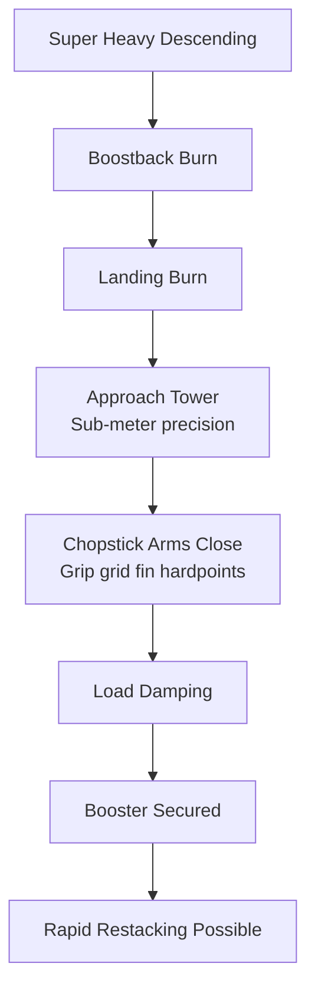

# Starship Catch System

> **The Starship catch system is SpaceX's tower-based mechanism — colloquially known as Mechazilla — that catches the Super Heavy booster in mid-air using giant mechanical arms, eliminating the need for landing legs entirely.**

## 🎯 Intuition
**The Core Idea:** Instead of carrying landing legs on every flight, catch the returning Super Heavy booster with giant arms on the launch tower itself.
**Analogy:** Rather than every airplane carrying its own portable runway, Mechazilla is the runway reaching up to grab the plane — moving the "landing gear" from vehicle to ground saves mass on every flight.
**Why It Matters:** Landing legs on Falcon 9 work but add mass and require post-flight processing. By moving the landing gear to the ground, SpaceX saves several tonnes of dry mass per flight, enables near-immediate restacking, and reduces pad turnaround toward airline-like operations. If extended to the Ship upper stage, Starship becomes the first fully and rapidly reusable orbital launch system.

## ⚙️ Core Mechanics
### Key Specifications

| Parameter | Value |
|---|---|
| System nickname | Mechazilla |
| Location | Starbase, Boca Chica, Texas |
| Tower height | ~146 m (480 ft) |
| Catch mechanism | Two chopstick arms (translate vertically, open/close horizontally) |
| Grip points | Grid fin attachment hardpoints near top of booster |
| Mass savings | Several tonnes of dry mass eliminated from Super Heavy |
| Precision required | Sub-meter positional and velocity tolerances |
| First successful catch | IFT-5, October 13, 2024 (Booster 13) |
| Future goal | Catch Starship Ship (upper stage) with same/similar system |

### Key Facts
- Mechazilla is the tower-based catch system at Starbase, Boca Chica, Texas
- Launch/integration tower stands ~146 m (480 ft) tall
- Two chopstick arms translate vertically and open/close horizontally to catch the booster
- Booster caught by hardpoints near the grid fins at top of stage
- Eliminating landing legs saves an estimated several tonnes of dry mass on Super Heavy
- First successful booster catch: IFT-5, October 13, 2024 (Booster 13 / B13)
- Catch tolerances require booster to arrive within a narrow positional and velocity window
- Load-damping systems in the arms absorb residual kinetic energy
- Future development aims to catch the Starship Ship (upper stage) using the same or similar tower system

### Catch Sequence

## 🔬 Deep Dive
### Engineering Details
With Falcon 9, SpaceX proved orbital-class boosters could land vertically on their own legs. For Super Heavy — a vehicle far larger and heavier (~200 t dry vs. Falcon 9's ~22 t) — SpaceX pursued a radically different approach: remove landing legs altogether and catch the booster with massive arms on the launch tower. This trades onboard landing hardware (legs adding dead mass to every flight) for ground-based infrastructure (tower and arms serving every flight from that pad).

The catch mechanism's two chopstick arms extend from the launch/integration tower. Each arm translates vertically along the tower and opens/closes horizontally. During a catch, Super Heavy performs landing burns to arrive at near-zero velocity just above the tower, guided to position between the arms. The arms close around the booster at the grid fin attachment hardpoints. Load-damping systems absorb residual kinetic energy. The catch must execute within tight tolerances — the booster must arrive within a defined corridor, and the tower's control system must synchronize arm closure with the booster's final descent.

On October 13, 2024, during IFT-5, Booster 13 launched, separated from the Ship, performed boostback and landing burns, and was caught by the tower arms — validating the concept and opening the path toward rapid restacking without horizontal transport or crane operations.

### Comparison — Landing Legs vs. Tower Catch

| Aspect | Landing Legs (Falcon 9) | Tower Catch (Starship / Mechazilla) |
|---|---|---|
| Mass penalty | ~2–3% of stage dry mass (legs on every flight) | Zero on-vehicle mass; infrastructure is ground-based |
| Landing precision required | ~1–3 m (pad center) | Sub-meter (tower arm corridor) |
| Post-landing processing | Transport from pad, leg retraction/removal | Booster remains on tower; potential rapid restacking |
| Pad turnaround | Hours to days (crane, transport) | Minutes to hours (theoretically) |
| Failure mode | Tip-over, leg failure → booster damaged on pad | Miss catch → booster lost; tower potentially damaged |
| Demonstrated | 200+ successful landings (2015–present) | First catch October 2024 (IFT-5) |
| Vehicle scale | Falcon 9 first stage (~22 t dry) | Super Heavy (~200 t dry) |
| Restack capability | Requires horizontal transport + crane ops | Direct vertical restacking on tower |

## 🏋️ Practice
### Warm-Up — 3 Conceptual Questions
1. Why does the mass savings from eliminating landing legs matter more for Super Heavy (~200 t dry) than it would for Falcon 9 (~22 t dry) in absolute payload terms?
2. What are the failure mode trade-offs: a Falcon 9 tip-over on the pad vs. a Mechazilla missed catch? Which is more catastrophic and why?
3. How does catching the booster directly at the launch mount change the restacking timeline compared to Falcon 9's horizontal-transport-and-crane workflow?

### Core Analysis — 2 "What If" Scenarios
1. What if the tower catch system achieves only 90% reliability (vs. Falcon 9's ~98% landing rate)? Given that a missed catch could damage the tower itself, analyze whether the mass savings and turnaround benefits still justify the approach.
2. What if SpaceX successfully extends tower catch to the Ship upper stage — how does catching both stages at the same tower change pad infrastructure requirements, cadence, and the economics of full Starship reusability?

### Challenge
1. Design the operational timeline: from Super Heavy catch to restacking with a new Ship and propellant loading for the next launch. Identify every step, estimate duration for each, and determine the critical path. What is the theoretical minimum time from catch to next launch, and what are the likely real-world bottlenecks?

## References

→ [[Sources Index]]
