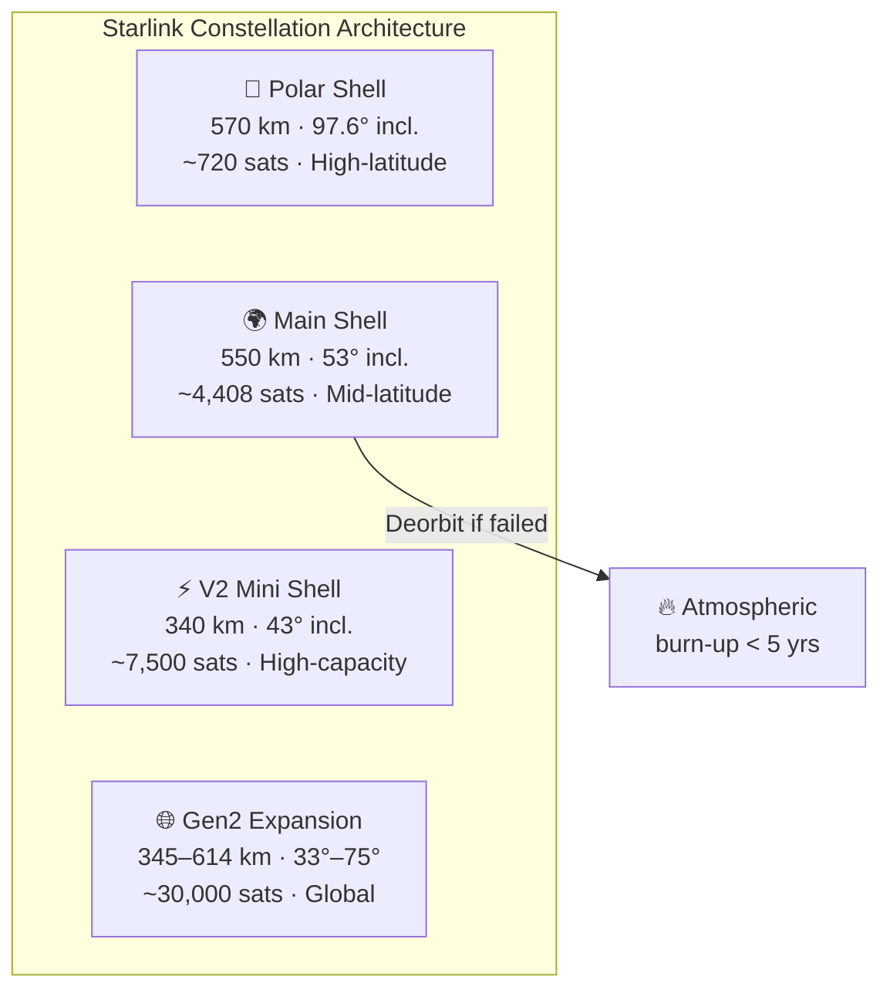

# Constellation Design and Orbits

> **Starlink distributes thousands of satellites across multiple orbital shells so low-latency internet can cover nearly the entire planet.**

## 🎯 Intuition
**The Core Idea:** Starlink achieves global broadband by spreading many satellites across different low-Earth orbit shells, each tuned for coverage, capacity, or latitude.
**Analogy:** Like cell towers in orbit — thousands of small stations circling the globe instead of a few giant ones far away.
**Why It Matters:** The multi-shell architecture is what transforms Starlink from a niche service into a global utility. By spreading satellites across altitudes and inclinations, SpaceX can layer capacity where demand is highest while still reaching remote polar regions. The built-in deorbit timeline addresses the single biggest criticism of mega-constellations—space debris—without relying on unproven active-removal technology. And ITU coordination, though bureaucratic, secures the electromagnetic real estate that makes the entire business viable.

---

## ⚙️ Core Mechanics

Starlink is a low-Earth orbit (LEO) satellite constellation designed by SpaceX to provide high-speed internet worldwide. Unlike geostationary satellites that orbit at ~35,786 km, Starlink operates between 340 km and 570 km altitude, slashing round-trip latency from ~600 ms to roughly 20–40 ms. The constellation is organized into discrete **orbital shells**, each defined by altitude, inclination, and number of orbital planes.

SpaceX received FCC authorization for an initial constellation of approximately **12,000 satellites** across several shells, and a subsequent Gen2 filing expanded the total authorization to roughly **42,000 satellites**. The primary operational shell sits at **550 km / 53° inclination**, while lower-altitude and higher-inclination shells fill polar coverage gaps and increase aggregate capacity. The 550 km altitude was chosen deliberately: low enough for acceptable latency, high enough for reasonable footprint size, and low enough that atmospheric drag will **deorbit any failed satellite within roughly five years**.

### Key Details / Specifications

| Shell | Altitude | Inclination | Sat Count (Authorized) | Primary Use |
|-------|----------|-------------|------------------------|-------------|
| Main (v1.x) | 550 km | 53° | ~4,408 | Mid-latitude broadband |
| Polar | 570 km | 97.6° | ~720 | Polar & high-latitude coverage |
| V2 Mini | 340 km | 43° | ~7,500 (Gen2) | High-capacity dense regions |
| Gen2 additional | 345–614 km | 33°–75° | ~30,000 (Gen2 total) | Global capacity expansion |

### Key Facts
- **Primary shell**: 550 km altitude, 53° inclination — carries the majority of operational v1.0/v1.5 satellites.
- **V2 Mini shell**: ~340 km altitude, 43° inclination — denser capacity layer for high-demand regions.
- **Polar shell**: ~570 km, 97.6° sun-synchronous — provides coverage over the poles and high latitudes.
- Initial FCC authorization: ~12,000 satellites; Gen2 expansion brings total to ~42,000.
- Each orbital plane contains 20–66 satellites depending on the shell, with planes evenly distributed in right ascension.
- At 550 km, a failed satellite re-enters the atmosphere within ~5 years due to residual atmospheric drag — no long-lived debris.
- SpaceX must coordinate orbital filings with the **ITU** (International Telecommunication Union) to secure Ku-band and Ka-band spectrum rights and avoid interference with other operators.
- As of mid-2025, over 6,700 operational satellites are in orbit, making Starlink more than half of all active satellites.

---

## 🔬 Deep Dive
### Engineering Details
Starlink is a low-Earth orbit (LEO) satellite constellation designed by SpaceX to provide high-speed internet worldwide. Unlike geostationary satellites that orbit at ~35,786 km, Starlink operates between 340 km and 570 km altitude, slashing round-trip latency from ~600 ms to roughly 20–40 ms. The constellation is organized into discrete **orbital shells**, each defined by altitude, inclination, and number of orbital planes. The primary operational shell sits at **550 km / 53° inclination**, optimized for coverage of densely populated mid-latitudes.

SpaceX received FCC authorization for an initial constellation of approximately **12,000 satellites** across several shells. A subsequent Gen2 filing expanded the total authorization to roughly **42,000 satellites**, making Starlink by far the largest satellite constellation ever attempted. Gen2 adds shells at lower altitudes (340 km for v2 Mini satellites) and higher inclinations (97.6° sun-synchronous orbits) to fill polar coverage gaps and increase aggregate capacity.

Each shell consists of multiple **orbital planes** spaced evenly around the equator, with satellites phased uniformly within each plane. This geometry ensures that as Earth rotates beneath the constellation, every point on the ground repeatedly falls within the footprint of at least one satellite. The 550 km altitude was chosen deliberately: low enough for acceptable latency, high enough for reasonable footprint size, and—critically—low enough that atmospheric drag will **deorbit any failed satellite within roughly five years**, addressing space-debris concerns without requiring active propulsion for disposal.

### Challenges and Risks
- Coordinating tens of thousands of satellites increases collision-avoidance and space-traffic-management complexity.
- Mega-constellation scale amplifies regulatory and spectrum-coordination pressure, especially through the ITU and national regulators.
- Lower orbits help with debris mitigation, but they also require continual replenishment because atmospheric drag is stronger.
- The architecture must balance latency, footprint size, and capacity; optimizing one dimension can degrade another.

### Comparison / Context
Starlink's shell design differs from traditional GEO satellite systems by trading a small number of distant spacecraft for a dense, layered LEO network. The result is much lower latency and more flexible capacity placement, but it comes at the cost of vastly higher launch cadence, fleet management complexity, and orbital coordination burden.

---

## 🏋️ Practice
### Discussion Questions
1. Why does placing satellites in multiple orbital shells improve both coverage and capacity compared with a single-shell design?
2. How do altitude and inclination choices change the trade-off between latency, geographic reach, and replenishment needs?
3. If Starlink continues expanding toward Gen2 scale, what secondary effects might that have on regulation, launch cadence, and orbital traffic management?

### Analysis Scenarios
1. Suppose SpaceX removed the polar shell but kept the main 53° shell. Which users would lose the most service quality, and why?
2. Imagine demand surges in a few dense metro regions. How would a lower, denser-capacity shell like V2 Mini help compared with simply adding more satellites to the main shell?

### Challenge
- Design a three-shell constellation strategy for a new operator that wants low latency, strong polar coverage, and controlled debris risk; explain why each shell exists.

---

*See also:* [[Satellite Generations]], [[Laser Inter-Satellite Links]], [[Ground Infrastructure]], [[SpaceX Funding and Valuation]]

## References

- [[SpaceX/Sources/Sources Index]]
- [[SpaceX/SpaceX Book Reading Spine]]
- [[SpaceX/SpaceX]]
