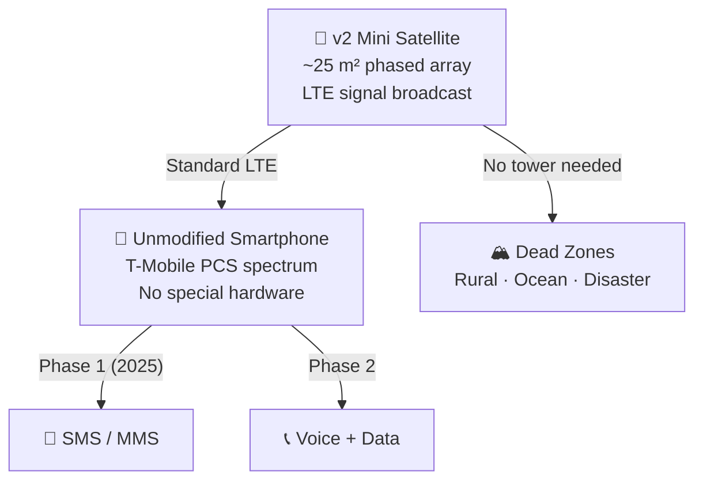

# Direct-to-Cell Technology

> **Starlink aims to send LTE service from orbit straight to ordinary smartphones, extending connectivity into areas with no cell towers.**

## 🎯 Intuition
**The Core Idea:** Starlink direct-to-cell turns certain satellites into orbiting LTE base stations that can talk to normal phones without special hardware.
**Analogy:** Like turning every satellite into a cell tower that talks directly to the phone in your pocket.
**Why It Matters:** Direct-to-cell has the potential to be Starlink's most disruptive service. There are roughly **8 billion mobile subscriptions** worldwide, yet vast areas lack any terrestrial cell coverage — rural highways, wilderness, developing regions, and disaster zones. If Starlink can deliver even basic connectivity to every existing phone on Earth, it creates an addressable market orders of magnitude larger than fixed broadband terminals. For T-Mobile, it turns "no service" into a coverage differentiator. For SpaceX, it opens a recurring-revenue channel attached to the world's largest consumer electronics platform: the smartphone.

---

## ⚙️ Core Mechanics

In August 2022, SpaceX and **T-Mobile** announced a partnership to deliver satellite-to-phone connectivity using Starlink satellites. The concept: equip v2 Mini satellites with a **large deployable antenna array** (~25 m² effective aperture) that transmits standard **LTE signals** directly to existing consumer handsets — no special hardware, no satellite phone, and no app required.

The **link budget** between a satellite at 340–550 km altitude and a handheld device with a tiny omnidirectional antenna and limited transmit power is extremely tight, so Starlink relies on the large spaceborne antenna, narrow spot beams, and advanced signal processing. Initial service, which entered beta in early 2025, supports **text messaging** (SMS/MMS), with voice and data planned for later phases.

**Regulatory approvals** are critical. The FCC granted SpaceX a supplemental coverage from space (SCS) license, and the competitive landscape includes **AST SpaceMobile**, **Lynk Global**, and Apple's iPhone 14+ emergency SOS via Globalstar. Starlink's advantage lies in its existing constellation scale, launch cadence, and the T-Mobile subscriber base.

### Key Details / Specifications

| Attribute | Starlink Direct-to-Cell | Traditional Starlink | AST SpaceMobile | Lynk Global |
|-----------|------------------------|---------------------|-----------------|-------------|
| User device | Unmodified smartphone | Starlink terminal (Dishy) | Unmodified smartphone | Unmodified smartphone |
| Initial service | SMS/MMS (2025) | Broadband (50–200+ Mbps) | Broadband (target) | SMS |
| Satellite type | v2 Mini w/ large antenna | v1.5 / v2 Mini | BlueBird (~1,500 kg) | Small sat (~25 kg) |
| Spectrum | T-Mobile PCS (licensed) | Ku/Ka-band (FSS) | MNO partner spectrum | MNO partner spectrum |
| Constellation scale | ~6,700+ satellites | Same constellation | 5 planned (initial) | ~10 demo sats |
| Key advantage | Existing scale & launch rate | Proven broadband | Higher per-sat bandwidth | First to demo |

### Key Facts
- Partnership announced August 2022 between SpaceX and T-Mobile; service branded as **"T-Mobile Starlink"** in the US.
- Uses **v2 Mini** satellites equipped with a large phased-array antenna (~25 m² effective area) for direct-to-handset beams.
- Transmits standard **LTE protocol** on T-Mobile's mid-band PCS spectrum (1900 MHz band); works with unmodified phones.
- Initial capability (beta 2025): **SMS and MMS text messaging**; voice and limited data planned for subsequent phases.
- The FCC's **Supplemental Coverage from Space (SCS)** framework governs spectrum sharing between terrestrial towers and satellites.
- Link budget is the primary constraint: satellite must compensate for the phone's low transmit power (~0.2 W) and omnidirectional antenna.
- International partners include Rogers (Canada), KDDI (Japan), Optus (Australia), One NZ (New Zealand), and others.
- Competitors: AST SpaceMobile (broadband-to-phone via large satellites), Lynk Global (text messaging), Apple/Globalstar (emergency SOS).

---

## 🔬 Deep Dive
### Engineering Details
In August 2022, SpaceX and **T-Mobile** announced a partnership to deliver satellite-to-phone connectivity using Starlink satellites. The concept: equip v2 Mini satellites with a **large deployable antenna array** (~25 m² effective aperture) that transmits standard **LTE signals** directly to existing consumer handsets — no special hardware, no satellite phone, no app required. A customer's ordinary smartphone, when out of range of terrestrial towers, would seamlessly connect to an overhead Starlink satellite using T-Mobile's mid-band PCS spectrum.

The technical challenges are formidable. The **link budget** between a satellite at 340–550 km altitude and a handheld device with a tiny omnidirectional antenna and limited transmit power is extremely tight. Starlink addresses this with the large spaceborne antenna, narrow spot beams, and advanced signal processing. Initial service, which entered beta in early 2025, supports **text messaging** (SMS/MMS) with voice and data planned for later phases. The low data rate reflects the physics: even with a massive satellite antenna, the uplink from a 0.2-watt phone at 500 km range constrains throughput.

**Regulatory approvals** are critical. The FCC granted SpaceX a supplemental coverage from space (SCS) license, establishing rules for spectrum sharing between terrestrial and satellite use of the same bands. Similar regulatory frameworks are emerging globally. The competitive landscape is active: **AST SpaceMobile** is building large satellites (BlueWalker 3 test, BlueBird constellation) targeting direct broadband to phones, and **Lynk Global** has demonstrated text-from-space capability. Apple's iPhone 14+ emergency SOS via Globalstar represents a narrower approach. Starlink's advantage lies in its existing constellation scale, launch cadence, and the T-Mobile subscriber base.

### Challenges and Risks
- The uplink is severely power-limited because ordinary phones have weak transmitters and non-directional antennas.
- Spectrum sharing between terrestrial carriers and satellites requires careful regulatory approval and interference management.
- Initial service levels are constrained by physics, so scaling from text messaging to voice and broadband is a major engineering step.
- Competitors with different satellite sizes and architectures may outperform Starlink in some direct-to-phone use cases.

### Comparison / Context
Direct-to-cell differs from standard Starlink broadband by targeting continuity of basic connectivity rather than high-throughput internet. It also sits in a competitive field where AST SpaceMobile emphasizes higher-bandwidth direct broadband and Lynk focuses on text-centric services, while Apple/Globalstar targets emergency-only use cases.

---

## 🏋️ Practice
### Discussion Questions
1. Why is the direct-to-cell link budget much harder than the link budget for a normal Starlink dish?
2. How does Starlink's direct-to-cell approach compare strategically with AST SpaceMobile and Lynk Global?
3. If direct-to-cell matures beyond texting, how could it change carrier competition and rural connectivity policy?

### Analysis Scenarios
1. A hurricane disables towers across a coastal region. How would direct-to-cell provide value even if its throughput remains limited?
2. Suppose regulators in a new country delay SCS-style approval. What part of the Starlink direct-to-cell rollout would slow down first: technology, business partnerships, or user adoption?

### Challenge
- Propose a phased rollout plan for direct-to-cell that starts with emergency messaging and grows toward broader consumer service without overpromising bandwidth.

---

## References

- [[SpaceX/Sources/Sources Index]]
- [[SpaceX/SpaceX Book Reading Spine]]
- [[SpaceX/SpaceX]]
