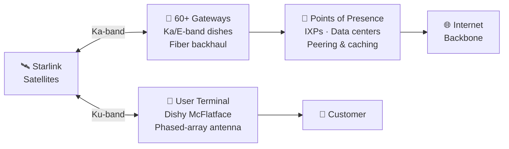

# Ground Infrastructure

> **Starlink's gateways, user terminals, and network points of presence connect the orbital network to the terrestrial internet and to customers.**

## 🎯 Intuition
**The Core Idea:** Starlink only becomes usable internet when satellites hand traffic down to ground gateways and user terminals carry that link into homes, vehicles, ships, and aircraft.
**Analogy:** Like highway on-ramps connecting the satellite sky-road to the internet's ground roads.
**Why It Matters:** No matter how many satellites orbit overhead, the customer experience is defined by the ground segment. Terminal cost and ease of setup determine adoption rate — SpaceX's self-install model (no technician visit) was a deliberate growth strategy. Gateway density and PoP placement determine backbone latency and throughput ceilings. And specialized maritime and aviation terminals have opened entirely new revenue streams. The ground infrastructure is where Starlink's technology meets the market, converting orbital physics into monthly subscriptions.

---

## ⚙️ Core Mechanics

The space segment is only half the system. On the ground, Starlink operates a global network of **gateway stations** — large radome-enclosed antennas that connect satellites to internet backbone fiber. Each gateway uses multiple Ka-band or E-band dishes to maintain simultaneous links with several satellites as they pass overhead, and gateways are sited near major internet exchange points with high-capacity fiber backhaul.

The customer-facing element is the **user terminal**, affectionately nicknamed **"Dishy McFlatface."** The terminal is a **phased-array antenna** that electronically steers its beam to track satellites across the sky with no moving parts (in later generations), while successive generations have reduced cost and improved weather resilience.

A growing network of **Points of Presence (PoPs)** enables peering, caching, and low-latency handoff to cloud providers and content delivery networks. Together, the ground segment translates orbital capacity into the user experience.

### Key Details / Specifications

| Terminal | Form Factor | Approx. Size | Motors | Target Segment | Approx. Price |
|----------|-------------|-------------|--------|----------------|---------------|
| Gen 1 (round) | Circular dish | 59 cm Ø | Yes (tilt) | Early residential | $499 |
| Gen 2 (rectangular) | Flat rectangle | 30 × 50 cm | No | Residential | $349–$499 |
| Gen 3 | Compact flat | Smaller | No | Residential | ~$299 |
| Maritime | Dome-enclosed | ~50 cm Ø | N/A (dome) | Ships, yachts | $2,500+ |
| Aviation (Flat High Perf.) | Low-profile panel | Fuselage-mount | No | Airlines, jets | Enterprise pricing |

### Key Facts
- **Gateways**: 60+ locations globally; each site has multiple Ka-band or E-band dishes under radomes; connected to backbone fiber.
- **User terminal Gen 1** (round): ~59 cm diameter, motorized tilt, ~$499 hardware cost at launch (subsidized).
- **User terminal Gen 2** (rectangular): ~30 × 50 cm, no motors, lower manufacturing cost, improved snow/heat performance.
- **User terminal Gen 3** (2024): most compact residential terminal; simplified design; retail price reduced to ~$299.
- **Maritime terminal**: high-gain, dome-enclosed for vessel mounting; supports speeds up to 350 Mbps; priced for commercial operators.
- **Aviation terminal**: FAA/EASA-certified flat-panel; installed on commercial airlines, business jets, and military aircraft.
- **Roaming**: users can take their terminal outside their registered service area; "Portability" and "Mobile Priority" plans support travel.
- **Points of Presence (PoPs)**: SpaceX networking nodes in major IXPs/data centers for peering and caching.

---

## 🔬 Deep Dive
### Engineering Details
The space segment is only half the system. On the ground, Starlink operates a global network of **gateway stations** — large radome-enclosed antennas that connect satellites to internet backbone fiber. Each gateway uses multiple Ka-band or E-band dishes to maintain simultaneous links with several satellites as they pass overhead. Gateways are sited near major internet exchange points and connected via high-capacity fiber backhaul, allowing traffic to exit the Starlink network and merge seamlessly with the broader internet. As of mid-2025, SpaceX operates gateways in over 60 locations worldwide, with continued expansion — though laser ISLs have reduced the urgency of gateway densification.

The customer-facing element is the **user terminal**, affectionately nicknamed **"Dishy McFlatface."** The terminal is a **phased-array antenna** — it electronically steers its beam to track satellites across the sky with no moving parts (in later generations). The first-generation dish was circular (~59 cm diameter), motorized to find optimal tilt on initial setup. The **second-generation rectangular terminal** (Gen 2, ~30 × 50 cm) dropped the motors, reduced cost, and improved weather resilience. The **Gen 3 terminal** (2024) is the most compact yet, further shrinking form factor while maintaining performance. All terminals are self-orienting: customers simply plug them in and place them with a clear sky view.

Beyond residential service, SpaceX offers specialized terminals for **maritime** vessels (high-performance dome-enclosed antennas), **aviation** (low-profile flat terminals certified for commercial aircraft), and **RV / mobile** use. A growing network of **Points of Presence (PoPs)** — SpaceX-operated networking nodes inside major data centers — enables peering, caching, and low-latency handoff to cloud providers and content delivery networks. Together, the ground segment translates orbital capacity into the user experience.

### Challenges and Risks
- Gateway placement depends on fiber availability, spectrum licensing, and suitable siting near backbone infrastructure.
- User terminal cost, manufacturing scale, and environmental resilience directly affect adoption and margin.
- Even with laser links, insufficient PoP and gateway capacity can bottleneck throughput and increase latency.
- Specialized aviation and maritime deployments face stricter certification, reliability, and installation requirements than residential service.

### Comparison / Context
Ground infrastructure is the interface between Starlink's space segment and the existing internet. Compared with traditional ISP infrastructure, Starlink shifts the last-mile challenge into the sky, but it still depends on terrestrial backhaul, peering, and customer hardware economics to deliver a competitive service.

---

## 🏋️ Practice
### Discussion Questions
1. Why are gateways and PoPs just as important as satellites in delivering low-latency internet service?
2. How did the evolution from Gen 1 to Gen 3 terminals change Starlink's adoption economics?
3. As laser ISLs improve, which parts of the ground network remain strategically essential?

### Analysis Scenarios
1. A country authorizes Starlink user terminals but delays approval for local gateways. How would that constrain service quality or expansion?
2. SpaceX wants to enter a new aviation market with strict certification rules. Which part of the ground and customer hardware stack becomes the hardest to scale quickly?

### Challenge
- Design a rollout strategy for a new region that balances gateway siting, PoP placement, and terminal affordability to maximize customer growth.

---

## References
- [[SpaceX/Sources/Sources Index|SpaceX Sources Index]]
