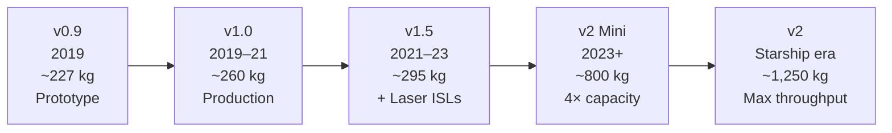

# Satellite Generations

> **Starlink satellites have progressed through multiple generations, each increasing capability, throughput, and efficiency while lowering cost per delivered bit.**

## 🎯 Intuition
**The Core Idea:** Each new Starlink satellite generation packs more networking capability into each launch, so the constellation gets better not just by adding satellites but by upgrading the spacecraft themselves.
**Analogy:** Like smartphone generations — each version more powerful, cheaper per bit, and packed with new features.
**Why It Matters:** The generational cadence is SpaceX's competitive moat. No other constellation operator iterates on satellite hardware this quickly. Each version delivers more throughput per kilogram launched, meaning the cost-per-bit drops with every upgrade cycle. The coupling of v2 full-size to Starship also creates a powerful internal flywheel: Starlink revenue funds Starship development, and Starship unlocks the full v2 constellation, which in turn generates more revenue. Understanding the generation boundaries is essential for interpreting capacity forecasts, coverage timelines, and financial projections.

---

## ⚙️ Core Mechanics

SpaceX's iterative hardware philosophy applies aggressively to Starlink. The **v0.9** prototypes launched in May 2019 as a batch of 60 test satellites, and within months SpaceX moved to **v1.0** production satellites weighing approximately **260 kg** each with krypton-fueled Hall-effect thrusters and autonomous collision-avoidance capability.

The **v1.5** generation added **laser inter-satellite links** and brightness-mitigation changes such as **sun visors** and adjusted satellite orientation. That upgrade allowed Starlink to serve customers over oceans, polar regions, and areas with no nearby ground station.

**V2 Mini** satellites, first launched in February 2023, weigh roughly **800 kg** and deliver approximately **4× the per-satellite capacity** of v1.0. The full-size **v2** satellite, designed exclusively for **Starship**, will weigh approximately **1,250 kg** and is tightly coupled to Starship operational readiness.

### Key Details / Specifications

| Version | Era | Mass (approx.) | Sats per F9 Launch | Laser Links | Key Advance |
|---------|-----|----------------|--------------------|-------------|-------------|
| v0.9 | 2019 | ~227 kg | 60 | No | Proof of concept |
| v1.0 | 2019–2021 | ~260 kg | 60 | No | Production broadband |
| v1.5 | 2021–2023 | ~295 kg | 60 (later 52–54) | Yes | Optical ISLs, sun visors |
| v2 Mini | 2023–present | ~800 kg | 21–23 | Yes | 4× capacity, E-band |
| v2 | Starship-planned full-size generation | ~1,250 kg | Starship-dependent | Yes | Max throughput, large aperture |

### Key Facts
- **v0.9** (2019): 60 prototype satellites; proof-of-concept mission; most have since deorbited.
- **v1.0** (~2019–2021): ~260 kg each, launched 60 per Falcon 9 flight, single solar array, krypton Hall thrusters.
- **v1.5** (~2021–2023): Added laser inter-satellite links; sun visors for brightness mitigation; same 60-per-launch cadence.
- **v2 Mini** (2023–present): ~800 kg, launched 21–23 per Falcon 9; ~4× capacity per satellite vs v1.0; E-band backhaul capability.
- **v2** (awaiting Starship): ~1,250 kg, too large for Falcon 9 fairing; highest per-satellite throughput planned.
- Across generations, per-satellite throughput has grown from ~15–20 Gbps (v1.0) to an estimated 60–80+ Gbps (v2 Mini).
- Sun visor program and operational attitude changes reduced satellite brightness by roughly 50%, though astronomers still flag impacts on survey telescopes.
- Each generation also improves the collision-avoidance autonomy and propulsion efficiency of the spacecraft.

---

## 🔬 Deep Dive
### Engineering Details
SpaceX's iterative hardware philosophy—borrowed from Falcon 9—applies aggressively to Starlink. The first **v0.9** prototypes launched in May 2019 as a batch of 60 test satellites. They validated the flat-pack stacking concept and basic Ku-band communication but lacked many production features. Within months, SpaceX moved to **v1.0**: production satellites weighing approximately **260 kg** each, launched in stacks of 60 on Falcon 9. These featured a single solar array, krypton-fueled Hall-effect thrusters for orbit raising and station-keeping, and autonomous collision-avoidance capability.

The **v1.5** generation, introduced in late 2021, added **laser inter-satellite links** (ISLs) — optical terminals enabling satellite-to-satellite communication without ground relay. This was a transformational upgrade: it allowed Starlink to serve customers over oceans, polar regions, and areas with no nearby ground station. SpaceX also added **sun visors** and adjusted satellite orientation to reduce brightness, responding to astronomers' concerns about mega-constellation light pollution.

**V2 Mini** satellites, first launched in February 2023 on Falcon 9, represent a generational leap. At roughly **800 kg**, they are three times heavier than v1.0 but deliver approximately **4× the per-satellite capacity** thanks to larger phased-array antennas and more powerful processors. They are the workhorses of the Gen2 constellation expansion. The full-size **v2** satellite, designed exclusively for **Starship**, will weigh approximately **1,250 kg** and deliver yet another capacity multiplier. Their size makes them incompatible with the Falcon 9 fairing, tightly coupling the Gen2 buildout to Starship operational readiness.

### Challenges and Risks
- Larger, more capable satellites can improve economics per spacecraft but reduce the number that fit on Falcon 9 launches.
- The full v2 architecture depends on Starship becoming operational at scale, creating an internal schedule dependency.
- Adding more features per generation increases hardware complexity, integration burden, and production pressure.
- Brightness mitigation improved astronomy impacts but did not eliminate them, so public and regulatory scrutiny remains.

### Comparison / Context
Starlink's hardware cadence resembles software release cycles more than traditional satellite programs. Instead of waiting many years between static designs, SpaceX pushes frequent generation changes that compound gains in capacity, laser networking, and launch efficiency.

---

## 🏋️ Practice
### Discussion Questions
1. Why does Starlink gain so much strategic advantage from improving satellite generations instead of only increasing satellite count?
2. How did v1.5 and v2 Mini each change the network in different ways?
3. If Starship enters routine service, how might that change the pace and scale of future Starlink upgrades?

### Analysis Scenarios
1. Suppose Starship is delayed by several more years. How does that affect the role of V2 Mini in Starlink's growth plan?
2. Imagine a competitor matches Starlink's satellite count but not its generation cadence. Where would Starlink still retain an operational advantage?

### Challenge
- Build a roadmap for a hypothetical v3 generation that improves throughput, brightness mitigation, and resiliency without making launch logistics unmanageable.

---

## References

- [[SpaceX/Sources/Sources Index]]
- [Spaceflight Now: upgraded Starlink V2 Mini satellites](https://spaceflightnow.com/2023/04/19/falcon-9-starlink-6-2-coverage/)
- [Spaceflight Now launch log](https://spaceflightnow.com/launch-log/)
