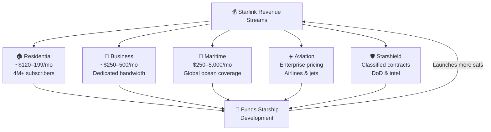

# Starlink Business Model

> **Starlink combines mass-market subscriptions and high-value enterprise, mobility, and government contracts to finance both the constellation and SpaceX's broader ambitions.**

## 🎯 Intuition
**The Core Idea:** Starlink makes money by selling recurring connectivity across multiple customer tiers, then uses that cash flow to expand the network and fund future SpaceX programs.
**Analogy:** Like Netflix for internet access — monthly subscriptions funding the next-gen constellation.
**Why It Matters:** Starlink is not just an internet service — it is the **financial engine of SpaceX**. Revenue from subscriptions funds Starship development, Raptor engine production, and launch infrastructure. This creates a uniquely self-reinforcing business loop: Starlink revenue builds Starship, Starship launches more (and larger) Starlink satellites, those satellites generate more revenue. For investors and space-industry observers, Starlink's financial performance is the single best predictor of SpaceX's ability to execute on Mars ambitions, Starship timelines, and future capital needs. A successful IPO would also create one of the largest telecommunications companies by market cap.

---

## ⚙️ Core Mechanics

At its core, Starlink is a **subscription broadband service**. Residential customers purchase a user terminal and pay a monthly fee — currently around **$120/month** in the US for the standard plan — for uncapped satellite internet, with economics driven by high upfront capital expenditure offset by recurring monthly revenue that scales with subscriber count.

SpaceX has also expanded into **premium market segments** with much higher per-user revenue: **Starlink Business**, **Starlink Maritime**, **Starlink Aviation**, and **Starshield**. These tiers span enterprises, ships, aircraft, and classified government users.

Starlink reportedly generated approximately **$6.6 billion in revenue in 2024**, up from ~$4.2 billion in 2023, with over **4 million subscribers** worldwide. Critically, Starlink revenue is the primary funding source for **Starship** development, creating an internal flywheel where satellite internet revenue finances the rocket that will deploy the next-generation constellation.

### Key Details / Specifications

| Tier | Monthly Price (US) | Target Customer | Speed (Typical) | Key Feature |
|------|--------------------|-----------------|-----------------|-------------|
| Residential Standard | ~$120 | Rural households | 50–200 Mbps | Uncapped data |
| Residential Priority | ~$199 | Power users | 100–300 Mbps | Priority during congestion |
| Business | ~$250–$500 | SMBs, enterprises | 100–350 Mbps | Dedicated throughput, SLA |
| Maritime | $250–$5,000 | Ships, yachts, rigs | 50–350 Mbps | Global ocean coverage |
| Aviation | Enterprise pricing | Airlines, jets | 100–350 Mbps | In-flight Wi-Fi |
| Starshield | Classified | DoD, intel agencies | Mission-dependent | Encryption, hardened |

### Key Facts
- **Consumer residential**: ~$120/month (US standard plan); ~$199/month for Priority with higher speeds.
- **Starlink Business**: ~$250–$500/month; higher throughput and priority data for SMBs and enterprises.
- **Maritime**: $250–$5,000/month depending on tier; serves commercial vessels, offshore platforms, and yachts.
- **Aviation**: enterprise contracts; installed on commercial airlines (e.g., United, Qatar Airways) and private jets.
- **Starshield**: government/military division; encrypted, high-assurance service; classified contract values.
- **Subscribers**: 4+ million as of early 2025, growing rapidly across 100+ countries.
- **Revenue**: estimated ~$6.6 billion in 2024; trajectory toward $10B+ within a few years.
- SpaceX has indicated a potential Starlink IPO once the business reaches stable, predictable cash flow.

---

## 🔬 Deep Dive
### Engineering Details
At its core, Starlink is a **subscription broadband service**. Residential customers purchase a user terminal and pay a monthly fee — currently around **$120/month** in the US for the standard plan — for uncapped satellite internet. This consumer tier targets the roughly 30–40 million US households (and hundreds of millions globally) that lack adequate broadband, particularly in rural and underserved areas. The economics are straightforward: high upfront capital expenditure on constellation deployment, offset by recurring monthly revenue that scales with subscriber count.

But consumer broadband is only one layer. SpaceX has aggressively expanded into **premium market segments** that command far higher per-user revenue. **Starlink Business** offers dedicated bandwidth and higher throughput for enterprises at ~$250–$500/month. **Starlink Maritime** charges $250–$5,000/month depending on speed tier, serving commercial shipping, cruise lines, and superyachts. **Starlink Aviation** equips commercial airlines and business jets, with contracts often exceeding $100,000/year per aircraft. And **Starshield** — the government and military variant — provides encrypted, hardened connectivity for defense and intelligence agencies under classified contracts worth potentially billions.

The financial trajectory is steep. Starlink reportedly generated approximately **$6.6 billion in revenue in 2024**, up from ~$4.2 billion in 2023, with over **4 million subscribers** worldwide. SpaceX has signaled that Starlink could pursue an **IPO** once revenue and cash flow become predictable, potentially unlocking a valuation of $100 billion or more for the division alone. Critically, Starlink revenue is the primary funding source for **Starship** development — creating an internal flywheel where satellite internet revenue finances the rocket that will deploy the next-generation constellation.

### Challenges and Risks
- Starlink must keep subscriber growth ahead of immense capital spending on launches, satellites, terminals, and ground infrastructure.
- Premium verticals such as aviation, maritime, and government depend on certifications, contracts, and long sales cycles.
- Consumer pricing pressure could emerge if terrestrial broadband expands in rural markets or competitors improve performance.
- The Starlink-to-Starship flywheel is powerful, but it also means setbacks in one program can affect the other.

### Comparison / Context
Starlink blends telecom, SaaS-like recurring revenue, hardware sales, and government contracting into one business. That makes it more diversified than a pure ISP, but also more operationally complex because each segment has different economics, regulation, and service expectations.

---

## 🏋️ Practice
### Discussion Questions
1. Why is Starlink's business model stronger with multiple customer tiers than with residential broadband alone?
2. How do maritime, aviation, and government contracts change the economics of the constellation?
3. If Starlink reaches stable cash flow and goes public, how might that alter SpaceX's broader financing strategy?

### Analysis Scenarios
1. Residential subscriber growth slows, but aviation and maritime adoption accelerates. How does that change Starlink's risk profile and revenue mix?
2. Starship development costs rise sharply in one year. How would Starlink's pricing, expansion pace, or enterprise sales priorities likely respond?

### Challenge
- Build a five-year revenue strategy for Starlink that balances affordable residential growth with higher-margin enterprise and government segments.

---

*See also:* [[Direct-to-Cell Technology]], [[SpaceX Funding and Valuation]], [[Commercial Launch Market]], [[Reusability Economics]]

## References
- [[SpaceX/Sources/Sources Index|SpaceX Sources Index]]
