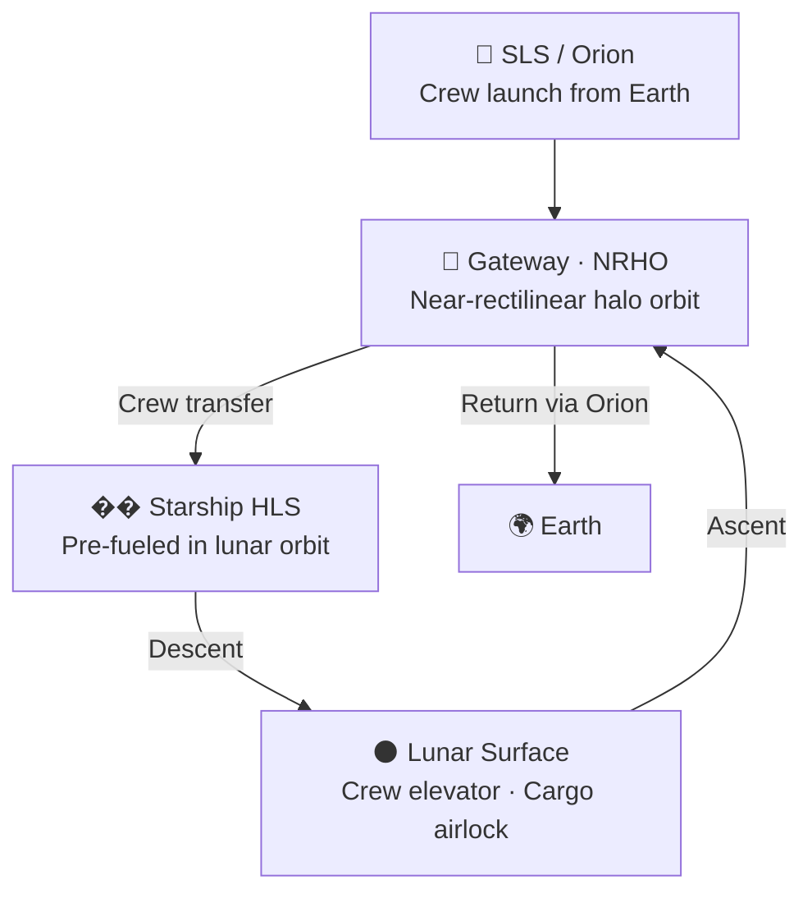

# Human Landing System

> **Starship HLS is the NASA-contracted lunar lander variant of Starship, selected to return astronauts to the Moon's surface under the Artemis program—the largest crewed lander ever designed.**

## 🎯 Intuition
**The Core Idea:** Starship HLS is a Moon-optimized version of Starship built to ferry astronauts between lunar orbit and the lunar surface as part of Artemis.
**Analogy:** Like a specialized elevator building that only operates on the Moon — optimized for one environment.
**Why It Matters:** Starship HLS dwarfs every previous lunar lander in payload capacity and habitable volume, enabling a qualitative leap in what astronauts can accomplish on the Moon. Where Apollo missions carried two crew for roughly three days with minimal equipment, Starship HLS can support larger crews with substantially more science hardware and consumables. Its selection validates Starship's versatility beyond Earth-orbit missions and anchors the Artemis program's long-term surface exploration roadmap.

---

## ⚙️ Core Mechanics

### Key Details / Specifications

| Attribute | Starship HLS | Apollo Lunar Module | Blue Origin Blue Moon Mk2 |
|---|---|---|---|
| **Height** | ~50 m | ~7 m | ~16 m |
| **Crew capacity** | 2+ (expandable) | 2 | 2 |
| **Payload to surface** | Tens of tonnes | ~0.3 t | ~3 t (uncrewed variant: 20 t) |
| **Propellant** | LOX/CH₄ | Aerozine-50/NTO | LOX/LH₂ |
| **Reusability** | Reusable in lunar context | Ascent stage expended | Reusable |
| **Requires refueling** | Yes (orbital) | No | Yes (orbital) |
| **Program** | Artemis III+ | Apollo 11–17 | Artemis V+ |

### Key Facts
- **HLS Option A contract:** $2.89 billion (April 2021), later expanded
- **Option B (Sustaining):** Follow-on contract for additional Artemis landings
- **Key modifications:** No heat shield, no flaps; added landing thrusters, elevator, cargo airlock
- **Landing thrusters:** High-mounted to minimize regolith disturbance
- **Crew access:** Elevator from cabin (~50 m height) to surface
- **Artemis integration:** Crew arrives via Orion/SLS; transfers to HLS in lunar orbit
- **Gateway compatibility:** Designed to dock at NRHO Gateway station
- **Prerequisite:** Orbital refueling demonstration required before crewed mission

---

## 🔬 Deep Dive
### Engineering Details
In April 2021, NASA awarded SpaceX a **$2.89 billion Human Landing System (HLS) Option A** contract to develop a Starship variant capable of landing astronauts on the lunar surface for the Artemis III mission and beyond. The contract was later expanded under subsequent options, and SpaceX was also selected for the **Sustaining Lunar Development (Option B)** contract to provide additional lunar landing missions, deepening the program's reliance on Starship architecture for Artemis.

The Starship HLS variant diverges significantly from the standard Ship. Because it operates only in the vacuum of space and on the lunar surface—never reentering Earth's atmosphere—it **omits the thermal protection heat shield and aerodynamic flaps**. Instead, it adds **high-mounted landing thrusters** positioned to avoid blasting the lunar regolith directly beneath the vehicle during touchdown. A crew **elevator system** lowers astronauts from the high-mounted crew cabin (roughly 50 meters above the surface) down to the regolith. The vehicle also includes a **cargo airlock** for transferring equipment and science payloads to the surface. Internally, it provides a pressurized crew cabin with life-support systems and accommodations for multi-day lunar surface stays.

The operational concept integrates Starship HLS with the broader Artemis architecture. Crew launches aboard NASA's Orion spacecraft on SLS, travels to lunar orbit—potentially docking with the **Gateway** station in near-rectilinear halo orbit (NRHO)—then transfers to the pre-positioned, fully fueled Starship HLS for descent to the surface. After the surface mission, Starship HLS ascends to lunar orbit for crew transfer back to Orion. This architecture leverages Starship's massive payload volume to deliver far more crew, cargo, and science equipment than any prior lunar lander.

### Challenges and Risks
Starship HLS depends on a demanding mission chain in which the lander must be pre-positioned and fully fueled before the crew arrives, making orbital refueling a critical prerequisite. Its extreme height also creates unusual surface operations challenges, which is why the design needs high-mounted landing thrusters to limit regolith blast effects and a tall elevator system to move crew safely between the cabin and the Moon. More broadly, Artemis relies on successful docking, transfer, and lunar-orbit integration with Orion and potentially Gateway, so failure in any one of those linked operations can disrupt the entire mission concept.

### Comparison / Context
Starship HLS is not just another lunar lander; it is dramatically larger than Apollo's Lunar Module and even other modern contenders such as Blue Moon Mk2. That scale changes mission possibilities by trading the compact, disposable logic of Apollo for a reusable lunar-context vehicle with much greater habitable volume, cargo delivery capability, and mission flexibility.

---

## 🏋️ Practice
### Discussion Questions
1. Why does Starship HLS remove heat-shield and flap hardware while adding landing thrusters, an elevator, and a cargo airlock?
2. In what ways does Starship HLS represent a different lunar mission philosophy from Apollo's Lunar Module?
3. If Starship HLS becomes operational, how could its scale change the long-term goals of Artemis surface exploration?

### Analysis Scenarios
1. Suppose orbital refueling slips significantly behind schedule. How would that affect Artemis missions that depend on a pre-positioned, fully fueled HLS in lunar orbit?
2. Imagine lunar regolith plume effects turn out to be worse than expected during landing. What tradeoffs would engineers face in thruster placement, landing procedures, and surface access design?

### Challenge
- Design a notional Artemis surface mission that uses Starship HLS's extra habitable volume and cargo capacity in ways Apollo never could, while still accounting for its dependence on orbital refueling and orbital crew transfer.

## References
- [[SpaceX/Sources/Sources Index|SpaceX Sources Index]]
