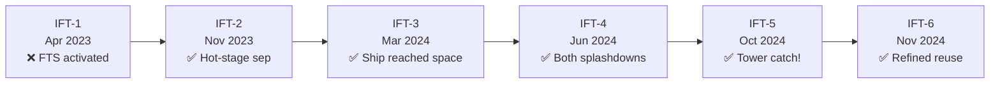

# Integrated Flight Tests

> **SpaceX's Integrated Flight Test (IFT) campaign is a rapid-iteration approach to full-stack Starship testing, with each successive flight building on lessons from the last to retire risk incrementally.**

## 🎯 Intuition
**The Core Idea:** The IFT campaign develops Starship by flying the full system early and often, then folding failures and successes directly into the next vehicle.
**Analogy:** Like a driving school that teaches by putting students on the road immediately, learning from each drive.
**Why It Matters:** The IFT campaign demonstrates that SpaceX's rapid-iteration development model scales to the largest launch vehicle ever built. Each flight retires critical risks—pad survivability, stage separation, reentry heating, propulsive landing—far faster than a traditional test-then-fly approach. The tower catch on IFT-5 validated the core reusability concept that underpins Starship's economic model.

---

## ⚙️ Core Mechanics

### Key Details / Specifications

| Flight | Date | Booster Outcome | Ship Outcome | Key Achievement |
|---|---|---|---|---|
| **IFT-1** | Apr 2023 | FTS activation | FTS activation | First full-stack launch; pad survivability data |
| **IFT-2** | Nov 2023 | Controlled breakup | RUD during coast | First hot-stage separation |
| **IFT-3** | Mar 2024 | Soft splashdown | Lost during reentry | Ship reached space; booster guided descent |
| **IFT-4** | Jun 2024 | Controlled splashdown | Controlled splashdown | Both stages achieved targeted water landings |
| **IFT-5** | Oct 2024 | Tower catch | Controlled splashdown | First booster tower catch |
| **IFT-6** | Nov 2024 | Tower catch | Controlled splashdown | Refined reusability operations |

### Key Facts
- **Testing philosophy:** Iterative fly-fix cycle; accept early failures to accelerate learning
- **Launch site:** Starbase, Boca Chica, Texas (with KSC LC-39A under development)
- **IFT-1 lesson:** Pad damage and engine-out behavior drove redesigned flame diverter and engine shielding
- **IFT-2 milestone:** First successful hot-stage separation
- **IFT-5 milestone:** First-ever booster tower catch by Mechazilla arms
- **Regulatory cadence:** Each flight requires FAA launch license review and mishap investigation closure
- **Rapid iteration:** Hardware improvements incorporated between flights on ~2–4 month cadence

---

## 🔬 Deep Dive
### Engineering Details
Rather than pursuing exhaustive ground qualification before flight, SpaceX follows an **iterative test-fly-fix** philosophy inherited from the Falcon program but applied at an accelerated cadence. Each Integrated Flight Test (IFT) exercises the full Starship stack—Super Heavy booster and Ship—with explicit test objectives that expand progressively. Early flights focused on clearing the launch pad and achieving stage separation; later flights targeted controlled descents, reentry survival, and ultimately propulsive recovery.

**IFT-1** (April 20, 2023) was the first full-stack launch from Starbase, Boca Chica. The vehicle cleared the pad but several Raptor engines failed during ascent; the flight termination system (FTS) was activated at approximately T+4 minutes. Despite the loss, the flight validated pad infrastructure and provided critical engine-out data. **IFT-2** (November 18, 2023) achieved successful hot-stage separation—a first for the program—but the Ship experienced a rapid unscheduled disassembly (RUD) during its coast phase. **IFT-3** (March 14, 2024) saw the Ship reach space for the first time and the booster execute a controlled soft splashdown in the Gulf of Mexico, though the Ship was lost during reentry.

**IFT-4** (June 6, 2024) marked a major milestone: both the booster and Ship achieved controlled splashdowns in their respective target zones, demonstrating end-to-end guidance, navigation, and control for both stages. **IFT-5** (October 13, 2024) accomplished the program's boldest objective yet—the first-ever **booster tower catch**, with Super Heavy returning to the launch tower's mechanical arms at Starbase. The Ship completed a controlled splashdown in the Indian Ocean. **IFT-6** (November 2024) and subsequent flights continued to refine reusability, payload deployment, and Ship recovery operations.

### Challenges and Risks
The IFT approach deliberately accepts early failures, which means each test flight can expose major issues in engines, pad systems, stage separation, reentry, or recovery operations. Progress is also gated by regulatory review, since every launch requires FAA licensing and closure of any mishap investigation before the next flight. Because the campaign tests the entire stack, setbacks can arise from interactions between many systems at once rather than from isolated component failures.

### Comparison / Context
The flight sequence shows how Starship development advanced from simply leaving the pad to demonstrating hot staging, reaching space, surviving controlled descent, and executing a tower catch. Instead of treating failures as reasons to pause until a final design is frozen, the campaign uses each flight as the main mechanism for learning, hardware revision, and risk retirement.

---

## 🏋️ Practice
### Discussion Questions
1. Why would SpaceX choose an iterative fly-fix approach for Starship instead of waiting for exhaustive qualification before the first launches?
2. Which milestone mattered more for long-term reusability: hot-stage separation, dual splashdowns, or the first booster tower catch?
3. How could repeated IFT success reshape confidence in Starship's economic and operational model over time?

### Analysis Scenarios
1. Imagine IFT-2 had failed before hot-stage separation. How would that have changed the order of technical risks the program needed to retire next?
2. Suppose a future flight succeeds technically but is followed by a long regulatory delay. How would that affect an iterative development model that depends on short turnaround between flights?

### Challenge
- Create a proposed objective ladder for the next three IFT missions that balances bold new goals against the need to protect the rapid-iteration cadence.

*See also:* [[Super Heavy Booster]], [[Starship Catch System]], [[Hot Staging Development]], [[Failures Recovery and Lessons Learned]]
