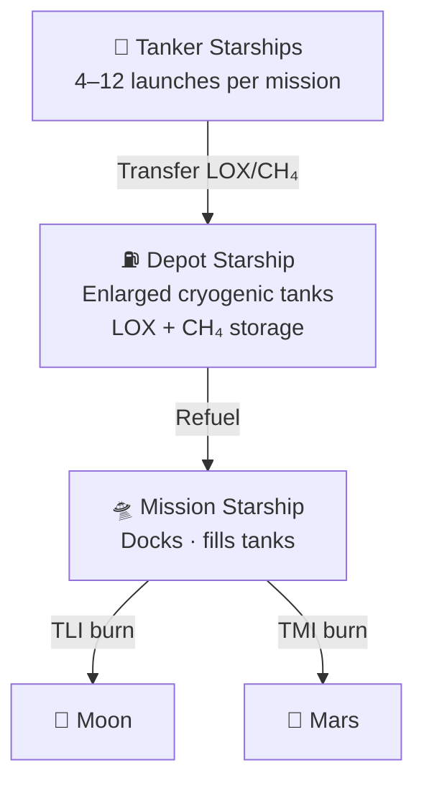

# Orbital Refueling

> **Orbital propellant transfer is the enabling technology that extends Starship's reach beyond low Earth orbit—without it, crewed missions to the Moon and Mars remain impractical at Starship's scale.**

## 🎯 Intuition
**The Core Idea:** Orbital refueling lets Starship refill after reaching low Earth orbit so it can still have enough propellant left for deep-space missions.
**Analogy:** Like a gas station in orbit — without it, Starship can only drive around the block (LEO).
**Why It Matters:** Without orbital refueling, Starship is limited to LEO missions—impressive but not revolutionary for deep-space exploration. Mastering cryogenic propellant transfer unlocks the Moon, Mars, and the outer solar system at scales no other architecture can match. It also creates a reusable in-space refueling infrastructure that could serve vehicles beyond Starship, fundamentally reshaping how humanity operates in cislunar space.

---

## ⚙️ Core Mechanics

### Key Details / Specifications

| Parameter | LEO Mission | Lunar (HLS) Mission | Mars Transit |
|---|---|---|---|
| **Refueling required** | None | Yes | Yes |
| **Est. tanker flights** | 0 | 4–8 | 8–12+ |
| **Depot needed** | No | Yes (or direct transfer) | Yes |
| **Boiloff sensitivity** | N/A | Moderate (days in orbit) | High (weeks in orbit) |
| **Delta-v after refuel** | N/A | ~6 km/s (TLI + landing) | ~4–6 km/s (TMI) |
| **Key risk** | N/A | Transfer demo timeline | Propellant logistics cadence |

### Key Facts
- **Why needed:** Ship expends most propellant reaching LEO; refueling restores full delta-v capacity
- **Depot concept:** Modified Starship with enlarged tanks, long-duration cryogenic management
- **Propellants transferred:** Sub-cooled LOX and liquid methane (CH₄)
- **Key challenges:** Cryogenic boiloff, zero-g ullage management, fluid coupling, transfer rates
- **NASA HLS milestone:** Propellant transfer demonstration required before crewed lunar landing
- **Tanker flights (lunar):** Estimated 4–8 per mission
- **Tanker flights (Mars):** Estimated 8–12+ per mission
- **Enabling infrastructure:** Rapid launch cadence and booster reuse essential to close the logistics loop

---

## 🔬 Deep Dive
### Engineering Details
Starship's fully reusable architecture delivers enormous mass to low Earth orbit, but reaching higher-energy destinations like the Moon or Mars requires the upper stage to depart LEO with a nearly full propellant load. Since the Ship burns most of its propellant during ascent, it must be **refueled in orbit** by one or more dedicated tanker Starships before performing trans-lunar or trans-Mars injection burns. The concept involves launching a **Depot Starship**—a modified variant with enlarged propellant tanks and minimal payload structure—into a parking orbit, then sending a series of Tanker Starships to rendezvous and transfer LOX and liquid methane to the depot. Once the depot is fully loaded, the mission Starship docks, fills its tanks, and departs.

The core engineering challenge is **cryogenic fluid management in microgravity**. Liquid oxygen (boiling point −183 °C) and liquid methane (−161 °C) boil off continuously in orbit from solar heating and vehicle heat soak. SpaceX must minimize boiloff through insulation and active cooling, manage ullage (the gas bubble above the liquid) to prevent vapor ingestion during transfer, and execute fluid transfer between two docked vehicles without settled propellant—requiring either acceleration settling (small thruster burns) or capillary-based liquid acquisition devices. NASA selected SpaceX to demonstrate propellant transfer technology as a critical milestone for the Human Landing System contract.

The number of tanker flights required depends on mission architecture and depot capacity. Estimates for a lunar mission range from roughly 4–8 tanker launches; a crewed Mars transit could require 8–12 or more. Reducing this count through higher Ship performance, lower boiloff, or larger depot capacity is a key optimization target. The overall cadence of tanker launches—potentially multiple flights per week from the same pad—drives Starship's rapid-reuse design requirements.

### Challenges and Risks
The hardest problem is keeping super-cold oxygen and methane usable in orbit long enough to complete multiple dockings and transfers. Boiloff, ullage control, coupling reliability, and transfer performance all become more difficult in microgravity, especially as mission duration increases from lunar to Mars-class timelines. The architecture also depends on frequent tanker launches and reusable operations; if cadence slips, the entire logistics chain becomes less practical.

### Comparison / Context
Orbital refueling changes mission design from a one-launch brute-force problem into a staged logistics system in orbit. For LEO missions, no refueling is needed, but lunar and Mars missions quickly become constrained by tanker count, depot performance, and cryogenic storage duration, which is why the same basic concept scales differently depending on destination.

---

## 🏋️ Practice
### Discussion Questions
1. Why does Starship need orbital refueling for lunar and Mars missions even though it can already reach low Earth orbit on its own?
2. Which is the bigger challenge for deep-space Starship missions: moving propellant between vehicles or launching enough tankers quickly enough?
3. If orbital refueling becomes routine, how might it change mission architectures beyond Starship itself?

### Analysis Scenarios
1. Suppose cryogenic boiloff in orbit is significantly worse than expected. How would that affect depot design, tanker count, and mission timing?
2. Imagine SpaceX can cut the number of tanker flights for a lunar mission from eight to four. What does that change operationally, economically, and in terms of mission risk?

### Challenge
- Propose a lunar refueling architecture that balances depot size, tanker cadence, and boiloff control while still meeting the requirement to fully load a mission Starship before departure.
