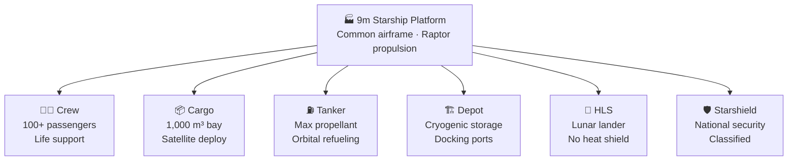

# Starship Variants and Applications

> **Starship's modular 9-meter platform supports a family of purpose-built variants—from crew transport and tanker to lunar lander and military asset—each tailored to a distinct mission profile.**

## 🎯 Intuition
**The Core Idea:** Starship is a shared spacecraft platform whose common structure can be customized into different mission-specific variants.
**Analogy:** Like a shipping container standard — one size frame, infinite cargo configurations.
**Why It Matters:** The variant strategy transforms Starship from a single rocket into an integrated **transportation and infrastructure ecosystem**. A common manufacturing line producing tankers, depots, crew ships, and landers at scale is what makes ambitious mission architectures—like sustained lunar presence or Mars colonization—logistically and economically feasible. No prior launch system has attempted this breadth of application from a single platform, and success would establish Starship as the backbone of human spaceflight for decades.

---

## ⚙️ Core Mechanics

### Key Details / Specifications

| Variant | Primary Role | Heat Shield | Flaps | Payload Bay | Crew Cabin | Notable Feature |
|---|---|---|---|---|---|---|
| **Crew** | Human transport | Yes | Yes | Converted to cabin | Yes (100+ pax) | Life support, windows |
| **Cargo** | Satellite/payload delivery | Yes | Yes | ~1,000 m³ | No | Deployable door |
| **Tanker** | Orbital refueling | Yes | Yes | Replaced by tanks | No | Max propellant volume |
| **Depot** | In-orbit fuel storage | Minimal | No | Replaced by tanks | No | Cryogenic management |
| **HLS** | Lunar landing | No | No | Cargo airlock | Yes (2+) | Elevator, landing thrusters |
| **Starshield** | National security | Likely | Likely | Classified | Mission-dependent | DoD/IC missions |
| **Point-to-point** | Earth city-to-city | Yes | Yes | Passenger seating | Yes | Suborbital trajectory |

### Key Facts
- **Crew Starship:** Pressurized cabin for 100+ passengers (Mars) or smaller crews (LEO/Moon)
- **Tanker Starship:** Maximized propellant capacity; no payload bay; supports orbital refueling
- **Depot Starship:** Long-duration cryogenic storage, docking ports, boiloff management
- **HLS Starship:** Lunar lander variant for NASA Artemis (no heat shield, added thrusters/elevator)
- **Starshield:** National security / military variant for DoD and intelligence community
- **Point-to-point:** Suborbital Earth transport concept (~30–60 min intercontinental flights)
- **Satellite deployment:** ~1,000 m³ volume enables massive constellation and mega-structure deployment
- **Space station concept:** Starship hull repurposed as orbital habitat module

---

## 🔬 Deep Dive
### Engineering Details
SpaceX designed Starship not as a single vehicle but as a **platform architecture** that can be adapted into multiple specialized variants sharing a common airframe, propulsion system, and manufacturing line. This modularity is central to the program's economics: high-volume production of a standardized stainless-steel structure drives down unit cost, while mission-specific modifications remain confined to the payload section and ancillary systems.

The **Crew Starship** is configured for human spaceflight, featuring a pressurized cabin designed to carry 100 or more passengers on interplanetary transits to Mars—or smaller crews on shorter missions. The **Tanker Starship** strips out the payload bay and replaces it with additional propellant tankage to maximize the fuel delivered per flight for orbital refueling operations. The **Depot Starship** serves as the in-orbit fuel reservoir: it features enlarged insulated tanks, cryogenic boiloff management systems, and docking ports for receiving propellant from tankers and dispensing it to mission vehicles. The **HLS Starship** is the lunar-landing variant built under NASA contract, with landing thrusters, a crew elevator, and no heat shield or flaps.

Beyond exploration, SpaceX has developed **Starshield**, a variant oriented toward national security and military applications, potentially including intelligence payloads, secure communications, and defense-related missions under contract with the U.S. Department of Defense and intelligence community. A **point-to-point Earth transport** concept envisions suborbital Starship flights connecting distant cities in under an hour, though regulatory and practical challenges remain substantial. Starship's ~1,000 m³ fairing volume also enables deployment of the largest satellite constellations, space telescopes, and in-space structures ever contemplated—and SpaceX has floated concepts for using Starship hulls as the building blocks of a future **orbital space station**.

### Challenges and Risks
The platform strategy only works if SpaceX can keep the common vehicle truly common while still making mission-specific changes where needed. Some variants introduce major demands—such as cryogenic storage for depots, life support for crew transport, lunar surface systems for HLS, or classified requirements for Starshield—that can complicate manufacturing, operations, and certification. Concepts like point-to-point Earth transport also face substantial regulatory and practical hurdles even if the hardware is technically feasible.

### Comparison / Context
The variant table shows how Starship shifts from a cargo launcher to a refueling tanker, depot, lunar lander, or military platform mainly by changing payload-space use, surface systems, and thermal/aerodynamic hardware. That is the heart of the architecture: one 9-meter-class base vehicle supports a much wider ecosystem than a conventional rocket family usually does.

---

## 🏋️ Practice
### Discussion Questions
1. Why is a common airframe more valuable to Starship than building completely separate vehicles for each mission type?
2. Which variant introduces the biggest departure from the base Starship design: tanker, depot, HLS, or Starshield?
3. If Starship succeeds as a platform, how could that change the structure of the space industry over the next few decades?

### Analysis Scenarios
1. Suppose SpaceX finds that depot and tanker variants are far easier to manufacture than crewed variants. How might that shape the order in which the broader ecosystem matures?
2. Imagine point-to-point transport remains impractical, but orbital habitat use becomes viable. How would that change the most important Starship applications?

### Challenge
- Design a phased roadmap for which Starship variants should be prioritized first if the goal is to build a self-supporting lunar and Mars logistics ecosystem as quickly as possible.

## References

- [[SpaceX/Sources/Sources Index]]
- [[SpaceX/SpaceX Book Reading Spine]]
- [[SpaceX/SpaceX]]
