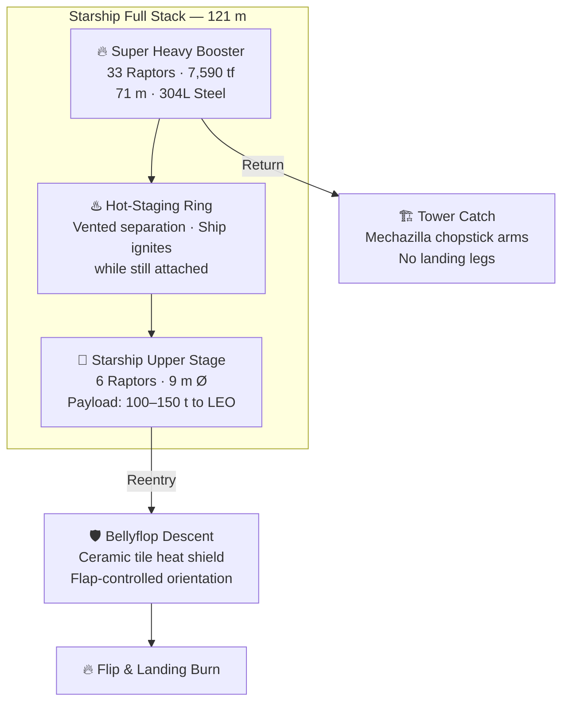

# Starship Vehicle Architecture

> **Starship is SpaceX's two-stage, fully reusable launch system—the largest and most powerful rocket ever built, designed to carry humans and cargo to the Moon, Mars, and beyond.**

## 🎯 Intuition
**The Core Idea:** Starship is a two-stage launch system built so both major pieces can return and fly again, combining super-heavy lift with spacecraft-like reusability.
**Analogy:** Like a fully reusable space shuttle done right — biggest rocket ever, designed to fly again and again.
**Why It Matters:** Starship's fully reusable architecture aims to reduce per-kilogram launch costs by one to two orders of magnitude compared to expendable vehicles. If successful, it fundamentally changes the economics of spaceflight—making orbital construction, deep-space crewed missions, and large-scale satellite deployment financially viable. Its cavernous payload volume enables entirely new mission architectures that were previously mass- or volume-constrained.

---

## ⚙️ Core Mechanics

### Key Details / Specifications

| Attribute | Starship (full stack) | Saturn V | SLS Block 1 | Falcon 9 |
|---|---|---|---|---|
| **Height** | ~121 m | 110.6 m | 98.1 m | 70 m |
| **Diameter** | 9 m | 10.1 m | 8.4 m | 3.7 m |
| **Liftoff thrust** | ~7,590 tf | ~3,400 tf | ~3,990 tf | ~845 tf |
| **Payload to LEO** | 100–150 t (reusable) | 130 t | 95 t | 22.8 t |
| **Reusability** | Fully reusable | Expendable | Expendable | Booster only |
| **Propellant** | LOX/CH₄ | LOX/RP-1 & LOX/LH₂ | LOX/LH₂ & SRBs | LOX/RP-1 |

### Key Facts
- **Total height:** ~121 m (booster + Ship stacked)
- **Diameter:** 9 m across both stages
- **Construction material:** 304L stainless steel
- **Ship engines:** 6 Raptors (3 sea-level + 3 vacuum), LOX/CH₄ propellant
- **Payload to LEO (reusable):** 100–150 tonnes
- **Payload volume:** ~1,000 m³ (larger than any existing fairing)
- **Heat shield:** Thousands of hexagonal ceramic tiles on the windward side
- **Reentry method:** Bellyflop with forward/aft flap control, flip-and-burn landing

---

## 🔬 Deep Dive
### Engineering Details
Starship is a fully reusable transportation system comprising two elements: the **Super Heavy** first-stage booster and the **Starship** (Ship) upper stage/spacecraft. Together they stand approximately 121 meters tall with a diameter of 9 meters, eclipsing every rocket in history. The entire stack is constructed from 304L stainless steel, chosen for its favorable strength-to-weight ratio at cryogenic and reentry temperatures, low cost, and ease of manufacturing compared to carbon composites or aluminum-lithium alloys.

The upper stage—confusingly also called "Starship" or simply "Ship"—serves as both the second stage and the on-orbit spacecraft. It is powered by six Raptor engines: three sea-level optimized (Raptor SL) and three vacuum-optimized (Raptor Vac) with extended nozzles. The cargo variant offers roughly 1,000 m³ of payload volume and can deliver 100–150 tonnes to low Earth orbit in the fully reusable configuration, with expendable capacity exceeding 200 tonnes.

Reentry is managed through a distinctive **bellyflop** maneuver. Starship descends broadside to the atmosphere, using two forward flaps and two aft flaps for attitude control, maximizing drag to bleed off velocity. The windward side is protected by a heat shield composed of thousands of hexagonal ceramic tiles designed to withstand temperatures exceeding 1,400 °C. Just before landing, the vehicle flips to a vertical orientation and performs a powered landing burn.

### Challenges and Risks
The architecture depends on making full reusability work across both stages, which means solving stage separation, booster recovery, thermal protection, and controlled landing as one integrated system. Starship's reentry profile is especially unusual, relying on flap-controlled bellyflop descent followed by a late flip-and-burn maneuver, while the heat shield must survive extreme temperatures with thousands of tiles working together. The scale of the vehicle also raises manufacturing, operational, and recovery complexity well beyond previous reusable launch systems.

### Comparison / Context
Compared with Saturn V, SLS, and Falcon 9, Starship combines super-heavy lift with a more aggressive reusability goal than any of them. That is the key architectural distinction: it is not just bigger, but designed to recover both the booster and the upper-stage spacecraft rather than treating high performance and reusability as mutually exclusive.

---

## 🏋️ Practice
### Discussion Questions
1. Why does Starship's architecture combine a giant booster with an upper stage that also functions as a spacecraft?
2. Which design choice matters more to Starship's long-term value: full reusability or extreme payload volume?
3. If Starship's architecture works as intended, what kinds of missions become practical that were previously unrealistic?

### Analysis Scenarios
1. Suppose the booster recovery system matures faster than Ship reentry and landing. How would that affect the usefulness of the overall architecture?
2. Imagine the stainless-steel approach proves cheaper to build but harder to optimize for mass than expected. What tradeoffs would that create against alternative materials?

### Challenge
- Outline a mission architecture that uses Starship's large payload volume and full-stack reusability to do something neither Falcon 9 nor SLS could do as efficiently.

*See also:* [[Super Heavy Booster]], [[Raptor Engine]], [[Thermal Protection System]], [[Starship Variants and Applications]]

## References

- [[SpaceX/Sources/Sources Index]]
- [[SpaceX/SpaceX Book Reading Spine]]
- [[SpaceX/SpaceX]]
