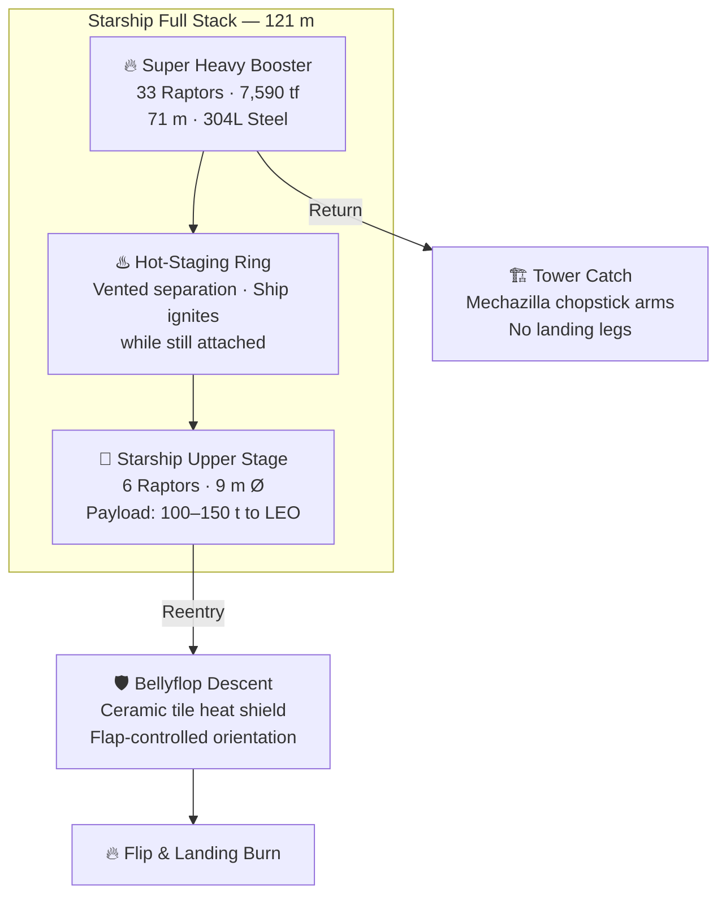

# Super Heavy Booster

> **Super Heavy is the first-stage booster of the Starship system—powered by 33 Raptor engines, it generates approximately 7,590 tonnes-force of thrust at liftoff, making it the most powerful rocket stage ever flown.**

## 🎯 Intuition
**The Core Idea:** Super Heavy is the reusable first stage that provides the immense thrust needed to launch the full Starship stack and then return for recovery.
**Analogy:** Like 33 sports car engines bolted together into one massive first stage that parks itself back at the launch tower.
**Why It Matters:** Super Heavy's unprecedented thrust enables Starship's massive payload capacity while remaining fully reusable. The tower-catch recovery concept, if proven reliable, allows dramatically faster booster turnaround than landing-pad approaches. Because the Raptor engine uses methane—producible from Martian atmospheric CO₂ and water ice via the Sabatier reaction—Super Heavy's propulsion architecture is a key enabler of SpaceX's long-term Mars colonization strategy.

---

## ⚙️ Core Mechanics

### Key Details / Specifications

| Attribute | Super Heavy | Saturn V S-IC | SLS Core Stage |
|---|---|---|---|
| **Engines** | 33 × Raptor 2 | 5 × F-1 | 4 × RS-25 |
| **Thrust (liftoff)** | ~7,590 tf | ~3,400 tf | ~1,600 tf (core only) |
| **Propellant** | LOX/CH₄ | LOX/RP-1 | LOX/LH₂ |
| **Material** | 304L stainless steel | Al-alloy | Al-Li alloy |
| **Recovery** | Tower catch (reusable) | Expended (ocean) | Expended (ocean) |
| **Height** | ~71 m | ~42 m | ~64.6 m |

### Key Facts
- **Engines:** 33 Raptors (20 outer fixed + 13 inner gimbaling)
- **Liftoff thrust:** ~7,590 tf (~74.4 MN)—most powerful rocket stage ever
- **Propellant:** Sub-cooled LOX/CH₄
- **Material:** 304L stainless steel
- **Stage separation:** Hot-staging via vented ring
- **Landing method:** Tower catch with Mechazilla arms (no landing legs)
- **Descent control:** Grid fins + engine burns
- **Key serials flown:** B7, B9, B10, B11, B12, B13, B14

---

## 🔬 Deep Dive
### Engineering Details
Super Heavy is a towering 304L stainless-steel cylinder roughly 71 meters tall and 9 meters in diameter, serving as the first stage of the Starship launch vehicle. It burns sub-cooled liquid oxygen and liquid methane (LOX/CH₄) through 33 Raptor engines arranged in two concentric rings: an outer ring of 20 engines and an inner ring of 13 engines. The inner engines gimbal for thrust vector control, while the outer engines are fixed. At full throttle, the stage produces roughly 7,590 tonnes-force (74.4 MN)—roughly double the thrust of the Saturn V's S-IC stage.

Stage separation uses a **hot-staging** technique: the Ship's engines ignite while still attached to the booster, with exhaust venting through a perforated hot-staging ring atop Super Heavy. This approach minimizes gravity losses and improves payload performance. After separation, the booster performs a **boostback burn** to reverse course toward the launch site, then uses grid fins for aerodynamic steering during descent and executes a precision landing burn targeting the launch tower's mechanical arms (the "chopstick catch"). The design deliberately eliminates landing legs to save mass and simplify turnaround.

SpaceX iterates rapidly on booster hardware. Booster serial numbers track this progression: B4 was the first full-scale prototype stacked, B7 flew on IFT-1, B9 on IFT-2, B10 on IFT-3, B11 on IFT-4, B12 on IFT-5 (first tower catch), B13 on IFT-6, and B14 on IFT-7. Each successive unit incorporates manufacturing and design improvements learned from prior flights and testing.

### Challenges and Risks
Super Heavy must coordinate 33 engines reliably at liftoff while also remaining recoverable, which creates major control, reliability, and integration challenges. Hot staging, boostback, aerodynamic steering, and tower catch all have to work in sequence, and the decision to remove landing legs shifts recovery difficulty onto precision guidance and tower hardware. Because the booster is being evolved iteratively, each new serial can improve performance while still introducing fresh operational risk.

### Comparison / Context
Compared with Saturn V's S-IC and the SLS core stage, Super Heavy stands out not just for thrust but for its reuse strategy. It pairs greater raw liftoff power with methane propulsion and an attempted tower-catch recovery method, making it both a heavy-lift stage and a central part of SpaceX's turnaround-speed ambitions.

---

## 🏋️ Practice
### Discussion Questions
1. Why is tower catch such an important part of the Super Heavy concept instead of using conventional landing legs?
2. How does Super Heavy differ from earlier heavy-lift boosters beyond simply having more thrust?
3. If Super Heavy becomes routinely reusable, how might that change the economics and tempo of launch operations?

### Analysis Scenarios
1. Suppose SpaceX can routinely launch Super Heavy but tower catches remain unreliable. What fallback strategies would preserve as much of the architecture's value as possible?
2. Imagine one engine-out event occurs during ascent on a later booster serial. How would that test the value of iterative development and engine-out tolerance?

### Challenge
- Propose an operational recovery sequence for Super Heavy that minimizes turnaround time while still accounting for the risks of boostback, grid-fin guidance, and tower catch precision.

## References
- [[SpaceX/Sources/Sources Index|SpaceX Sources Index]]
