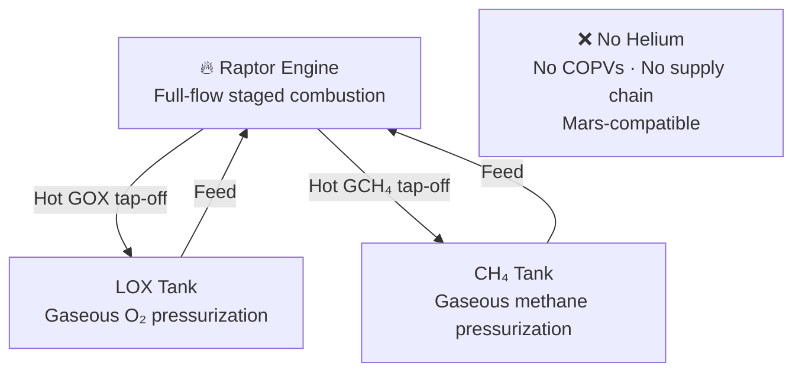

# Autogenous Pressurization

> **Starship pressurizes its tanks using heated gaseous methane and oxygen from its own engines, removing the need for helium.**

## 🎯 Intuition
**The Core Idea:** Starship keeps tank pressure up by feeding back hot gaseous versions of its own propellants instead of carrying a separate helium pressurization system.
**Analogy:** Like a self-inflating tire that uses its own air instead of needing a separate pump (helium tank).
**Why It Matters:** Autogenous pressurization is one of the architectural choices that makes Starship viable as a fully and rapidly reusable vehicle. Removing helium eliminates a recurring consumable cost, removes a complex and failure-prone subsystem, and makes the vehicle compatible with off-Earth propellant production.

---

## ⚙️ Core Mechanics
Every liquid-propellant rocket must keep its propellant tanks pressurized during flight. As engines consume propellant, ullage volume grows and pressure falls; without active pressurization, turbopumps can cavitate and engine performance can collapse.

Historically, many rockets solve this with high-pressure helium stored in COPVs and routed into the tanks through regulators. Starship instead uses autogenous pressurization: a small amount of hot gaseous oxygen and hot gaseous methane is tapped from the Raptor cycle and sent back to the matching tanks.

### Key Details / Specifications

| Attribute | Autogenous Pressurization | Helium Pressurization |
|---|---|---|
| Pressurant gas | Heated propellant (GOX / GCH₄) | Helium (inert) |
| Supply dependency | None (uses onboard propellant) | Helium supply chain (finite resource) |
| Hardware complexity | Simpler (no COPVs, fewer regulators) | Complex (COPVs, fill systems, regulators) |
| Self-regulation | Yes (condensation feedback) | No (requires active regulation) |
| Mars compatibility | Yes (propellants produced via ISRU) | No (no helium source on Mars) |
| Flight heritage | Saturn V (partial), Starship (full) | Atlas, Delta, Falcon 9, most launchers |
| Risk profile | Engine-coupled (tap-off reliability) | COPV rupture risk (cf. Amos-6) |

### Key Facts
- Falcon 9 uses helium stored in composite overwrapped pressure vessels (COPVs) submerged in the LOX tank.
- A COPV failure during helium loading caused the Amos-6 loss in September 2016, highlighting COPV risk.
- Raptor's full-flow staged combustion cycle naturally produces hot gas streams of both propellants, making autogenous tap-off straightforward.
- Gaseous oxygen pressurizes the LOX tank; gaseous methane pressurizes the CH₄ tank.
- Eliminates hundreds of helium-related components: COPVs, fill/drain valves, regulators, and plumbing.
- Autogenous pressurization is self-regulating: excess pressurant condenses back into the bulk propellant.
- Enables in-situ resource utilization (ISRU) on Mars, where methane and oxygen can be produced via the Sabatier process.
- Some prior vehicles, such as the Saturn V S-II stage, used autogenous pressurization for the hydrogen tank, but Starship applies it to both tanks.

---

## 🔬 Deep Dive
### Engineering Details
Falcon 9 and Falcon Heavy use helium pressurization, storing helium inside carbon-composite bottles submerged in the liquid oxygen tank. Starship departs from that approach entirely. In the Raptor system, hot gaseous oxygen and methane are already available in a full-flow staged combustion architecture, so a portion can be routed back into the tanks to maintain ullage pressure.

Because the pressurant is chemically identical to the liquid already in each tank, over-pressurized gas can condense or mix back into the propellant rather than creating contamination or requiring a separate inert-gas management problem. That gives the system a useful self-regulating tendency while also eliminating a major set of helium-specific hardware.

The motivation is strategic as well as mechanical. Helium is finite, price-volatile, and difficult to treat as a scalable consumable for a high-flight-rate system. For Mars operations, it is worse than expensive: it is unavailable locally. By closing the pressurization loop around methane and oxygen, SpaceX aligns tank management with the same propellant pair it intends to manufacture off Earth.

### Challenges and Risks
- The pressurization system is tightly coupled to engine tap-off performance and routing reliability.
- Tank pressure must stay within safe margins as engine demand and thermal conditions change through flight.
- Hot-gas handling adds thermal management and plumbing design challenges.
- Eliminating helium removes COPV risk, but it also shifts failure modes toward engine-integrated pressurization control.

### Comparison / Context

| Context | Relevance to Starship |
|---|---|
| Falcon 9 helium system | Proven, but hardware-heavy and exposed to COPV-related risk |
| Saturn V partial autogenous use | Demonstrates heritage for the concept, though not full dual-tank application |
| Mars ISRU architecture | Strongly favors methane/oxygen self-pressurization because those propellants can be produced locally |

---

## 🏋️ Practice
### Discussion Questions
1. Why does tank ullage pressure matter so much for turbopump-fed engines?
2. How does autogenous pressurization change the tradeoff between subsystem simplicity and engine-system coupling compared with helium pressurization?
3. How might Mars mission architecture push future launch systems toward self-pressurizing propellant strategies?

### Analysis Scenarios
1. What happens if methane pressurization lags during a high-throttle engine burn while oxygen pressurization remains nominal?
2. If a reusable launcher aims for airline-like operations, how do helium logistics compare with an autogenous approach over hundreds of flights?

### Challenge
- Design a fault-detection strategy that can distinguish between a tank-pressure control issue, a hot-gas tap-off problem, and a sensor fault during ascent.

---

*See also:* [[Technology Deep Dives Overview]]

## References
- [[SpaceX/Sources/Sources Index|SpaceX Sources Index]]
