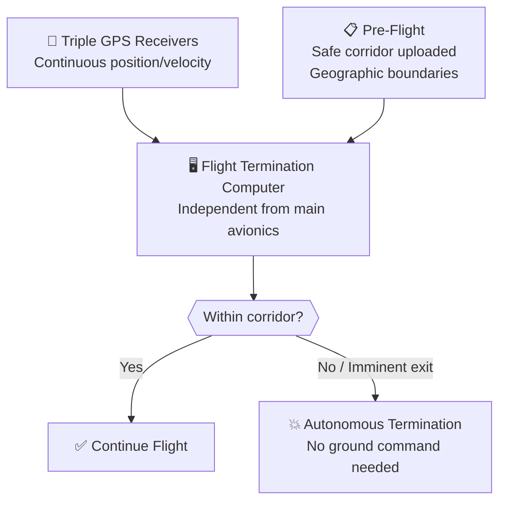

# Autonomous Flight Termination System

> **SpaceX's Autonomous Flight Termination System puts range-safety logic on board, allowing the rocket to destroy itself if it leaves its approved flight corridor.**

## 🎯 Intuition
**The Core Idea:** AFTS replaces a ground officer's destruct command with an onboard computer that monitors the rocket's trajectory and acts automatically if it becomes unsafe.
**Analogy:** Like a self-driving car's emergency brake — the rocket monitors itself and terminates if it goes off course, no human needed.
**Why It Matters:** AFTS is a prerequisite for the launch cadence SpaceX now sustains. By moving the safety function on board, it reduces dependence on ground infrastructure, removes a major scheduling bottleneck, and makes multi-site and over-ocean operations more practical.

---

## ⚙️ Core Mechanics
For decades, U.S. orbital launches depended on a Range Safety Officer who could send a radio destruct command if a vehicle veered off course. That model required ground radar, communications links, and human monitoring throughout ascent.

AFTS moves that safety chain on board. Before launch, the approved flight corridor is uploaded to independent flight termination computers. During flight, redundant GPS receivers continuously determine position and velocity, and the system autonomously triggers termination if the rocket exits or is about to exit safe limits.

### Key Details / Specifications

| Attribute | Traditional Range Safety | AFTS |
|---|---|---|
| Decision authority | Ground-based Range Safety Officer | On-board flight computer |
| Tracking method | Ground radar + telemetry downlink | On-board GPS receivers |
| Destruct command path | Radio uplink from ground station | Internal signal, no RF link needed |
| Downrange infrastructure | Required (tracking stations) | Not required |
| Human in the loop | Yes (RSO) | No (autonomous) |
| Cadence impact | Bottleneck (RSO scheduling, range time) | Enables rapid turnaround |
| Ocean overflight | Needs ship-based tracking or gaps | Full autonomous coverage |

### Key Facts
- AFTS uses triple-redundant GPS receivers and independent flight termination computers separate from the main avionics.
- The safe-flight corridor is computed pre-flight and loaded before launch.
- Eliminates the need for ground-based radar tracking stations downrange that were historically required for every launch.
- Enables launches over trajectories where no ground tracking infrastructure exists, such as polar launches from Vandenberg over open ocean.
- First orbital-class AFTS flight: Falcon 9, June 2017 (CRS-11 mission from LC-39A).
- Certification involved extensive hardware-in-the-loop testing and Monte Carlo simulation campaigns reviewed by the Space Force.
- Reduces per-launch range costs because fewer ground assets must be activated.
- Directly supports SpaceX's high-cadence launch model by removing the RSO scheduling bottleneck.

---

## 🔬 Deep Dive
### Engineering Details
Legacy range safety relied on a human decision-maker supported by external tracking and communications networks. That worked, but it imposed fixed infrastructure needs and constrained where and how often launches could occur.

SpaceX moved the full logic chain on board: precomputed geographic safety boundaries are loaded before launch, redundant GPS inputs provide continuous navigation data, and an independent termination computer evaluates whether the rocket remains within allowable limits. If it does not, the termination ordnance is triggered internally without requiring a ground uplink.

SpaceX spent years qualifying this architecture with the U.S. Space Force's 45th Space Wing before Falcon 9 flew the first operational orbital-class AFTS in 2017. The concept then expanded to Falcon Heavy and forms part of the baseline safety architecture for Starship-era operations.

### Challenges and Risks
- The system must be extremely reliable because it removes the human override from the real-time termination decision.
- GPS and onboard computation must remain robust under ascent dynamics, vibration, and failure conditions.
- Certification is demanding because regulators must trust autonomous destruct logic in place of traditional range operations.
- Independence from main avionics is essential; otherwise a common-mode failure could disable both guidance and safety functions.

### Comparison / Context

| Context | Significance |
|---|---|
| Legacy RSO model | Safe but infrastructure-heavy and cadence-limiting |
| Falcon 9 AFTS certification | Proved an orbital-class launcher could meet autonomous range-safety standards |
| Falcon Heavy and Starship adoption | Shows AFTS scaled from a single launcher to a broader reusable-launch architecture |

---

## 🏋️ Practice
### Discussion Questions
1. Why does range safety become a launch-cadence problem when every mission depends on ground personnel and tracking assets?
2. How does AFTS change the tradeoff between operational flexibility and certification complexity compared with a traditional RSO system?
3. How might autonomous range safety evolve as private launch sites and point-to-point flight concepts become more common?

### Analysis Scenarios
1. What if a vehicle temporarily loses one GPS receiver during ascent but remains otherwise healthy—how should a triple-redundant AFTS architecture respond?
2. If SpaceX wants multiple launches in rapid succession from different sites, which bottlenecks disappear with AFTS and which still remain?

### Challenge
- Define a high-level verification plan that would convince regulators an autonomous termination system is safer than a ground-commanded destruct architecture.

---

*See also:* [[Mission Control and Launch Operations]], [[Avionics and Flight Software]], [[Launch Cadence and Turnaround Records]]
