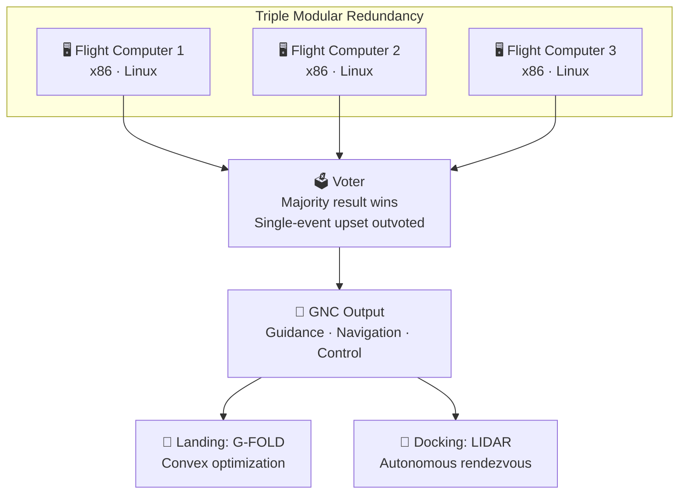

# Avionics and Flight Software

> **SpaceX runs triple-redundant Linux-based flight computers on custom hardware, using voting redundancy instead of relying only on traditional radiation-hardened processors.**

## 🎯 Intuition
**The Core Idea:** SpaceX uses multiple commercial flight computers running the same software and trusts the majority answer, gaining modern computing performance while tolerating single-computer faults.
**Analogy:** Like running three smartphones simultaneously and trusting whichever two agree — redundancy through consumer hardware.
**Why It Matters:** Avionics and software are the nervous system of every SpaceX vehicle. Using commercial processors with voting redundancy let SpaceX iterate faster, exploit modern compute performance, and enable demanding capabilities such as autonomous docking, booster landing optimization, and large-scale satellite autonomy.

---

## ⚙️ Core Mechanics
Traditional space avionics often depend on expensive, lower-performance radiation-hardened processors. SpaceX took a different path on Falcon 9: three identical x86-based flight computers run in parallel, and a voter accepts the majority result if one system suffers a radiation-induced upset.

That architecture is paired with in-house software running on a real-time Linux environment. For crewed Dragon missions, SpaceX adds radiation-hardened processors to meet NASA human-rating expectations while preserving the broader redundancy philosophy.

### Key Details / Specifications

| Attribute | SpaceX Approach | Traditional Space-Grade |
|---|---|---|
| Processors | Commercial x86 (COTS) | Radiation-hardened (e.g., RAD750, GR740) |
| Radiation strategy | Triple-redundancy voting (TMR) | Rad-hard silicon + limited redundancy |
| Operating system | Linux (real-time kernel) | VxWorks, RTEMS, or bare-metal |
| Development cycle | CI/CD with hardware-in-the-loop | Waterfall with formal verification |
| Cost per unit | Low (commercial silicon) | High ($100K–$500K per processor) |
| Performance | Current-generation compute | Often 10–15 years behind commercial |
| Crew-rated variant | Adds rad-hard layer (Dragon) | Rad-hard baseline for all missions |

### Key Facts
- Falcon 9 flies three x86-based flight computers in a triple-modular-redundancy voting architecture.
- Flight computers run a real-time Linux operating system rather than a traditional RTOS like VxWorks.
- Dragon crew vehicles use radiation-hardened processors to meet NASA human-rating standards.
- Powered descent guidance for booster landing is based on convex optimization in the G-FOLD family.
- Dragon's autonomous docking system uses LIDAR, thermal cameras, and machine-vision algorithms for relative navigation.
- Starlink satellites carry onboard avionics with autonomous collision-avoidance maneuvering.
- Starlink uses krypton Hall-effect thrusters controlled by onboard flight software for orbit raising and station-keeping.
- SpaceX employs a CI/CD pipeline for flight software with extensive hardware-in-the-loop testing.

---

## 🔬 Deep Dive
### Engineering Details
Traditional aerospace avionics rely on rad-hard processors that are robust against the space environment but costly, slower, and often far behind commercial silicon in performance. SpaceX chose a different trade: commercial x86 processors running Linux, multiplied through triple modular redundancy so a single upset can be outvoted.

At each computation cycle, three units independently produce the same guidance, navigation, and control outputs. A voter then selects the majority result. This gives SpaceX access to modern processors and development ecosystems while preserving fault tolerance. For crewed Dragon missions, SpaceX augments the architecture with radiation-hardened processors because NASA's human-rating requirements demand a more conservative reliability envelope.

The software philosophy extends beyond launch vehicles. Dragon performs autonomous rendezvous and docking using LIDAR and camera data. Falcon 9 boosters execute powered descent guidance based on convex optimization. Starlink satellites manage collision avoidance, propulsion, attitude knowledge, and inter-satellite coordination through onboard software tied into a broader constellation-management system.

### Challenges and Risks
- Commercial processors are more vulnerable to radiation effects, so redundancy and voting logic must be exceptionally robust.
- Common-mode software or hardware faults can defeat a majority-vote architecture if all lanes fail the same way.
- Real-time Linux and CI/CD provide agility, but they also demand strong testing discipline for flight-critical code.
- Human-rated missions raise the certification bar, forcing SpaceX to blend rapid iteration with stricter assurance practices.

### Comparison / Context

| Context | Implication |
|---|---|
| Falcon 9 TMR avionics | Prioritizes fast iteration and modern compute using redundancy |
| Dragon crew architecture | Adds rad-hard protection where human-rating requirements tighten risk tolerance |
| Starlink onboard autonomy | Extends SpaceX's software-first model from launch vehicles to a massive satellite fleet |

---

## 🏋️ Practice
### Discussion Questions
1. Why might a launch company prefer triple-redundant commercial processors over a single rad-hard processor?
2. How does the tradeoff between redundancy and specialized hardware change when moving from Falcon 9 to crewed Dragon?
3. How could SpaceX's software-first philosophy influence future spacecraft autonomy and operations at constellation scale?

### Analysis Scenarios
1. If one flight computer experiences a radiation-induced bit flip during ascent, what must the voter and surrounding system do to keep the mission safe?
2. Suppose a bug affects all three software lanes identically—why is that more dangerous than a single hardware upset, and how should testing address it?

### Challenge
- Propose a fault-management scheme that distinguishes between a single-lane upset, a sensor disagreement, and a common-mode software error in a triple-redundant flight computer system.

---

*See also:* [[Technology Deep Dives Overview]]
