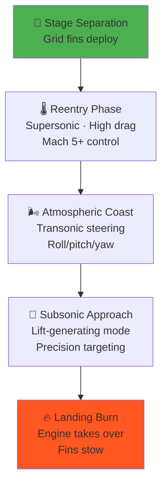

# Grid Fins and Aerodynamic Control

> **Grid fins give Falcon 9 aerodynamic steering authority during atmospheric descent, making precise booster recovery possible from supersonic reentry through subsonic approach.**

## 🎯 Intuition
**The Core Idea:** Falcon 9 uses four deployable grid fins to steer the booster through the atmosphere after stage separation until the landing burn takes over.
**Analogy:** Like waffle-iron paddles that steer a falling skyscraper back to its launch pad.
**Why It Matters:** Without grid fins, precision booster landing would be far more difficult using aerodynamic control alone. They fill the control gap between vacuum thrusters and engine gimbaling, and the switch to reusable titanium fins directly supports Falcon 9's turnaround economics.

---

## ⚙️ Core Mechanics
After stage separation, the Falcon 9 first stage falls back through a huge range of flight conditions, from near-vacuum at apogee to supersonic reentry and finally subsonic terminal approach. Grid fins provide roll, pitch, and yaw control across that descent corridor.

The fins deploy after separation, work alongside cold-gas thrusters and engine guidance during descent, and remain active until the final landing phase. Their lattice geometry is especially useful because it generates high drag at high speed while still providing controllability as the stage slows.

### Key Details / Specifications

| Attribute | Grid Fins | Planar Fins | No Fins (Thruster-Only) |
|---|---|---|---|
| Supersonic effectiveness | High (high drag + control) | Moderate (shock interactions) | Low in atmosphere |
| Subsonic effectiveness | Good (lift-generating) | Good | Poor in atmosphere |
| Stowed volume | Compact (fold flat) | Larger stow envelope | N/A |
| Reusability (thermal) | Excellent (titanium) | Material-dependent | N/A |
| High angle-of-attack control | Strong | Prone to stall | N/A |
| Weight penalty | Moderate | Lower | Lowest |
| Heritage | Soviet missiles, SpaceX | Traditional aircraft/missiles | Capsules, upper stages |

### Key Facts
- Four grid fins are mounted symmetrically around the booster circumference just below the interstage.
- Early Falcon 9 flights from 2015 to 2017 used cast aluminum fins that could ablate or warp during reentry.
- Block 5 titanium grid fins are the largest single titanium castings in aerospace, each about 4 ft × 5 ft.
- Grid fins deploy after stage separation and stow flush against the booster for launch.
- They remain effective from roughly Mach 5+ through subsonic flight, covering the full descent corridor.
- Each fin has independent actuation, enabling combined roll, pitch, and yaw authority.
- Titanium fins have flown 20+ times on individual boosters with no reported replacement.
- Prior grid-fin applications include the Soviet Vympel R-77 air-to-air missile and Soyuz launch escape hardware.

---

## 🔬 Deep Dive
### Engineering Details
Mounted on hinge mechanisms just below the interstage, four independently actuated fins deploy after stage separation and stay active until moments before landing. The flight computer commands fin deflections using guidance solutions that account for atmospheric density, vehicle attitude, and the desired path to the landing target.

Grid fins have a long aerospace heritage because they fold compactly, remain effective at high angles of attack, and perform well in high-speed flow. SpaceX first used cast aluminum fins, but those could suffer from reentry heating and required more refurbishment. With Falcon 9 Block 5, SpaceX switched to cast titanium fins that can survive reentry without ablating, making repeated reuse practical.

Their lattice geometry is central to the design choice. At supersonic speed it creates substantial drag while still producing control forces, helping decelerate and steer the booster. As the stage slows, the fins transition toward more conventional lift-generating behavior, preserving control through the lower-speed approach regime.

### Challenges and Risks
- The fins must remain controllable across a very wide aerodynamic envelope, from hypersonic/supersonic descent to subsonic approach.
- Reentry heating places severe material demands on the fins and hinge structures.
- Actuation systems must survive vibration, thermal cycling, and repeated reuse.
- Control authority has to integrate cleanly with cold-gas thrusters and engine gimbaling without destabilizing the descent solution.

### Comparison / Context

| Context | Why It Matters |
|---|---|
| Early aluminum fins | Proved the concept but exposed refurbishment and thermal-limit issues |
| Block 5 titanium fins | Turned grid fins into a durable reusable subsystem instead of a consumable |
| Thruster-only control | Works in vacuum but lacks the atmospheric authority needed for precision landing |

---

## 🏋️ Practice
### Discussion Questions
1. Why are grid fins better suited than cold-gas thrusters for steering a booster through dense atmosphere?
2. How do the tradeoffs between grid fins, planar fins, and thruster-only control change across supersonic and subsonic flight?
3. How might future reusable launch vehicles adapt aerodynamic control surfaces beyond Falcon 9's grid-fin model?

### Analysis Scenarios
1. What happens to landing accuracy if one grid fin actuator becomes sluggish during transonic descent?
2. If SpaceX had kept aluminum fins instead of switching to titanium, how would that likely affect refurbishment time and booster economics?

### Challenge
- Outline a control-allocation strategy for blending grid-fin deflection, cold-gas attitude control, and engine gimbal authority during a Falcon 9 recovery sequence.

---

*See also:* [[Technology Deep Dives Overview]]

## References

- [[SpaceX/Sources/Sources Index]]
- [[SpaceX/SpaceX Book Reading Spine]]
- [[SpaceX/SpaceX]]
