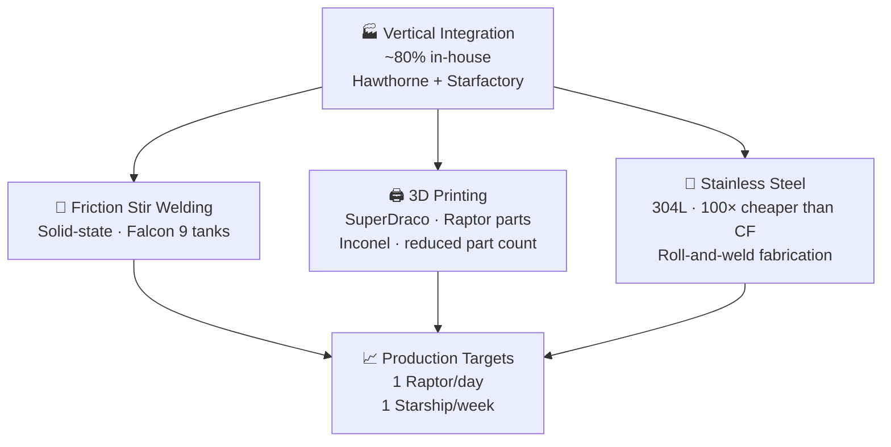

# Manufacturing Innovation

> **SpaceX lowers cost and speeds iteration by building most rocket hardware in-house and combining vertical integration with modern fabrication methods such as friction stir welding, 3D printing, and stainless-steel production.**

## 🎯 Intuition
**The Core Idea:** SpaceX treats rocket manufacturing more like an integrated high-speed factory system than a slow outsourced aerospace program.
**Analogy:** Like Tesla's gigafactory approach applied to rockets — build everything in-house, iterate fast, scale production.
**Why It Matters:** Manufacturing is where SpaceX's cost advantage is realized. Vertical integration shortens iteration cycles, modern fabrication methods reduce part count and cost, and the Starfactory model is SpaceX's attempt to make launch-vehicle production faster, cheaper, and more routine.

---

## ⚙️ Core Mechanics
Traditional aerospace programs often rely on a prime contractor coordinating many subcontractors. SpaceX inverted that model by colocating design, manufacturing, and operations, allowing engineers to move directly between design problems and the factory floor.

That organizational model is paired with manufacturing choices intended for speed and scale: friction stir welding for Falcon tank structures, additive manufacturing for engine hardware, and stainless-steel roll-and-weld construction for Starship. Together, these choices support the goal of high-rate rocket production rather than low-volume bespoke builds.

### Key Details / Specifications

| Attribute | SpaceX Model | Traditional Aerospace Outsourcing |
|---|---|---|
| Integration | ~80 % in-house (vertical) | Heavily outsourced (prime + subcontractors) |
| Iteration speed | Days to weeks (co-located teams) | Months (distributed supply chain) |
| Welding technology | Friction stir welding (solid-state) | TIG / MIG fusion welding (common) |
| Additive manufacturing | Extensive (engines, manifolds) | Limited or prototype-only |
| Primary structure material | Stainless steel (Starship), Al-Li (Falcon) | Aluminum-lithium, carbon fiber |
| Production rate target | 1 Raptor/day, 1 Starship/week | Single-digit vehicles per year |
| Factory philosophy | Automotive-inspired flow production | Job-shop / batch production |

### Key Facts
- SpaceX manufactures about 80% of vehicle components in-house, including engines, avionics, structures, and fairings.
- Hawthorne, California serves as headquarters, primary factory, and mission control center.
- Falcon 9 tank barrel and dome joints use friction stir welding for high-strength solid-state welds.
- SuperDraco engines are 3D-printed from Inconel via selective laser melting, making them among the first printed engines on a crewed vehicle.
- Raptor engine components such as injectors and manifolds use additive manufacturing to reduce part count.
- Starship's shift from carbon fiber to stainless steel reduced material cost by roughly two orders of magnitude.
- Starfactory at Boca Chica is intended for high-rate Starship and Super Heavy production.
- Production targets include roughly one Raptor engine per day and, long term, one Starship per week.

---

## 🔬 Deep Dive
### Engineering Details
In a traditional launch program, the prime contractor manages a distributed supplier base for engines, valves, structures, avionics, and other subsystems. That adds cost, schedule latency, and coordination overhead. SpaceX instead concentrated design and production under one roof in Hawthorne, creating a feedback loop where engineers can inspect builds directly and implement changes far faster than a dispersed supply chain allows.

The technical side of that philosophy shows up in fabrication choices. Falcon 9 tanks use friction stir welding, a solid-state process that is especially well suited to aluminum-lithium structures because it produces strong, consistent welds with lower defect risk than conventional fusion welding. SuperDraco engines demonstrated that additive manufacturing could move beyond prototyping into critical flight hardware, while Raptor uses printed components to reduce part count and enable internal geometries such as complex cooling passages.

Starship extended the same logic to primary structure. SpaceX abandoned an earlier carbon-fiber direction in favor of 301/304L stainless steel, which is vastly cheaper, widely available, and compatible with comparatively simple roll-and-weld manufacturing. Starfactory is the industrial expression of that choice: a purpose-built facility aimed at pushing rocket production toward automotive-style rate manufacturing.

### Challenges and Risks
- Vertical integration increases internal complexity because SpaceX must master more disciplines instead of pushing them to suppliers.
- High-rate production only works if tooling, quality control, and automation mature alongside design changes.
- Additive manufacturing reduces part count, but it introduces validation and process-control demands for flight-critical hardware.
- Stainless-steel production is cheaper, but scaling to weekly vehicle builds requires supply-chain discipline and factory throughput that are unusual in aerospace.

### Comparison / Context

| Context | Meaning |
|---|---|
| Hawthorne vertical integration | Compresses engineering-to-production feedback loops |
| Falcon friction stir welding | Shows process innovation applied to serial rocket structure production |
| Starfactory and stainless steel | Marks the shift from conventional aerospace manufacturing toward factory-scale launch-vehicle production |

---

## 🏋️ Practice
### Discussion Questions
1. Why does vertical integration speed iteration compared with a traditional subcontractor-heavy aerospace model?
2. How do friction stir welding, additive manufacturing, and stainless-steel construction each change the manufacturing trade space in different ways?
3. What would have to change across the launch industry for weekly rocket production to become normal rather than exceptional?

### Analysis Scenarios
1. If SpaceX outsourced Raptor production to external suppliers, how would that likely affect iteration speed, cost, and schedule risk?
2. Suppose Starfactory reaches high engine output but tank production lags—what does that reveal about bottlenecks in vertically integrated manufacturing?

### Challenge
- Design a high-level factory metrics dashboard that would let SpaceX monitor whether its manufacturing system is actually converging toward one-engine-per-day and one-Starship-per-week production.

---

*See also:* [[Technology Deep Dives Overview]]

## References

- [[SpaceX/Sources/Sources Index]]
- [[SpaceX/SpaceX Book Reading Spine]]
- [[SpaceX/SpaceX]]
