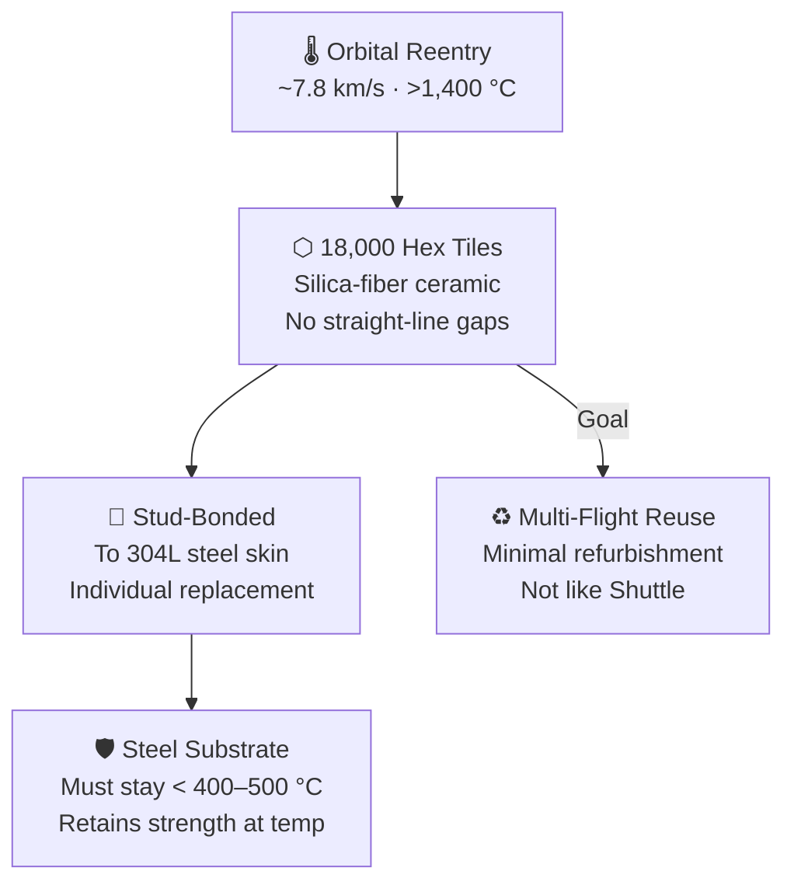

# Thermal Protection System

> **Starship uses roughly 18,000 ceramic hex tiles on its windward side to survive reentry heating while keeping the underlying stainless-steel structure within safe temperatures.**

## 🎯 Intuition
**The Core Idea:** Starship survives reentry by covering its hottest surfaces with individually attached ceramic tiles that block heat from reaching the steel hull.
**Analogy:** Like 18,000 ceramic bathroom tiles protecting a spacecraft from 1,400°C reentry — each one individually attached.
**Why It Matters:** TPS is one of the hardest problems in making an orbital vehicle fully reusable. If tiles require constant inspection and replacement, turnaround time and cost explode, so Starship's business case depends on a TPS that stays attached, survives reentry, and needs minimal refurbishment.

---

## ⚙️ Core Mechanics
During orbital reentry, Starship's windward side is exposed to extreme aerodynamic heating. The thermal protection system must absorb and reradiate that heat while keeping the stainless-steel structure below the temperature range where its mechanical properties degrade too far.

SpaceX's solution is a belly-side mosaic of ceramic hex tiles attached to studs on the steel skin. The hexagonal layout reduces straight-line gap paths for hot gas, while narrow clearances allow thermal expansion and make individual tile replacement possible.

### Key Details / Specifications

| Attribute | Starship TPS | Shuttle TPS (LI-900 / HRSI) | PICA-X (Dragon) |
|---|---|---|---|
| Geometry | Hexagonal tiles | Square / rectangular tiles + blankets | Monolithic ablative shield |
| Material | Silica-fiber ceramic | Silica-fiber ceramic (LI-900, LI-2200) | Phenolic impregnated carbon ablator |
| Reusability | Designed for many flights | Reusable but labor-intensive refurbishment | Limited reuse (ablates each flight) |
| Attachment | Stud-bonded to steel skin | RTV adhesive + strain isolator pad | Bonded to composite structure |
| Gap management | Hex geometry avoids linear gaps | Gap fillers required (frequent maintenance) | N/A (monolithic) |
| Substrate | Stainless steel (304L) | Aluminum structure + felt insulation | Carbon-fiber composite |
| Peak temperature rating | ~1,400–1,500 °C surface | ~1,260 °C (HRSI) | ~1,850 °C (ablation regime) |

### Key Facts
- Approximately 18,000 hexagonal tiles cover Starship's windward belly surface.
- Tiles are primarily silica-fiber-based ceramic, engineered for low thermal conductivity and high emissivity.
- The hexagonal shape eliminates straight-through seam paths, reducing plasma intrusion risk.
- Each tile is attached through studs welded to the stainless-steel skin, allowing individual replacement.
- Peak reentry surface temperatures exceed 1,400 °C, while the steel substrate must remain below roughly 400–500 °C.
- Stainless steel was chosen in part because it retains useful strength at elevated temperatures better than aluminum-lithium.
- IFT-3 and later Starship flights provided real-world TPS performance data that fed iterative improvements.
- Dragon uses PICA-X, but that is an ablative system rather than a reusable tile shield in the same sense.

---

## 🔬 Deep Dive
### Engineering Details
At orbital velocity, Starship encounters intense heating loads that demand more than bare metal can tolerate. SpaceX covers the windward side and key edge regions with silica-fiber ceramic tiles roughly 15–20 cm across, conceptually related to Shuttle-era ceramics but different in layout, attachment, and operational philosophy.

Each tile is shaped and mounted individually on studs welded to the steel skin. That arrangement allows replacement without disturbing surrounding tiles and gives SpaceX more flexibility in handling local geometry changes. The hexagonal pattern is deliberate: unlike square layouts, it avoids continuous straight seams that can provide easier hot-gas paths toward the underlying structure.

SpaceX has iterated tile generations based on flight data, improving bond reliability, gap behavior, and attachment robustness. The long-term goal is not merely surviving reentry, but doing so with airline-like maintenance expectations rather than Shuttle-style labor intensity. SpaceX has also explored future transpiration-cooling concepts as a possible supplement or alternative for some Starship variants.

### Challenges and Risks
- Tile attachment reliability is critical because a lost tile can expose the steel structure to localized overheating.
- Gap management is difficult because the TPS must accommodate thermal expansion without creating hot-gas intrusion paths.
- Reentry loads vary across the vehicle, forcing the system to handle both global thermal stress and local hotspots.
- Achieving true rapid reuse requires flightworthy durability and inspection simplicity, not just one-time survival.

### Comparison / Context

| Context | Relevance |
|---|---|
| Shuttle tile experience | Demonstrated ceramic-tile reusability but also showed how maintenance burden can dominate operations |
| Dragon PICA-X heat shield | Handles extreme heating well, but through ablation rather than tile-by-tile multi-flight reuse |
| Starship future concepts like transpiration cooling | Suggest SpaceX may eventually supplement or partially replace tile-based TPS in some regimes |

---

## 🏋️ Practice
### Discussion Questions
1. Why does reusable orbital TPS become an operations problem as much as a materials problem?
2. How do Starship's hex tiles differ from Shuttle tiles and Dragon's PICA-X in geometry, maintenance philosophy, and reuse model?
3. How might future Starship variants blend tile-based protection with active cooling concepts?

### Analysis Scenarios
1. What happens if a small cluster of tiles is lost before peak heating on reentry?
2. If Starship's tiles survive heating but require labor-intensive inspection after every flight, how would that affect the economics of full reusability?

### Challenge
- Propose a TPS health-monitoring approach that could help detect tile loss, bond degradation, or hotspot formation before they become catastrophic during reentry.

---

*See also:* [[Starship Vehicle Architecture]], [[Integrated Flight Tests]], [[Mars Transit and Entry]], [[Manufacturing Innovation]]
